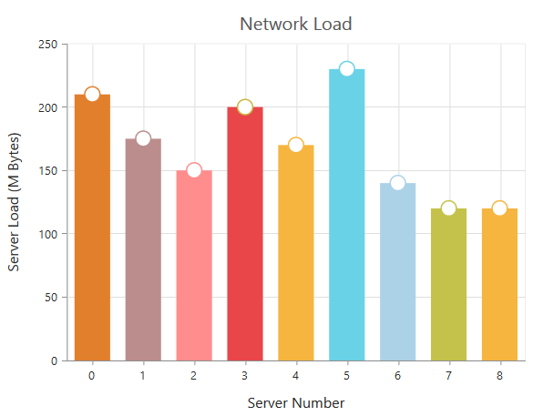

# Appearance

## Custom Color Palette

The Chart displays different series in different colors by default. You can customize the color of each series by providing a custom color palette of your choice by using the [`palette`](../api/ejchart#members:palette) property. 



/// <reference path="tsfiles/jquery.d.ts" />
/// <reference path="tsfiles/ej.web.all.d.ts" />

module ChartComponent {
    $(function () {
        var chartsample = new ej.datavisualization.Chart($("#chartcontainer"), {

            //Providing a custom palette
            palette: [ "grey", "skyblue", "orange", ],         

            // ...
         });
        });
    }



N> The Color palette is applied to the points in accumulation type series

## Built-in Themes

Following are the built-in themes available in the Chart

* flatLight
* flatDark
* gradientLight
* gradientDark
* azure
* azureDark
* lime
* limeDark
* saffron
* saffronDark
* gradient-azure
* gradient-azureDark
* gradient-lime
* gradient-limeDark
* gradient-saffron
* gradient-saffronDark

You can set your desired theme by using the [`theme`](../api/ejchart#members:theme) property. Flat light is the default theme used in the Chart.



      var chartsample = new ej.datavisualization.Chart($("#chartcontainer"), {
            
            //Using gradient theme
            theme: "gradientlight",         

            // ...
        });



## Point level customization

Marker, data label and fill color of each point in a series can be customized individually by using the [`points`](../api/ejchart#members:series-points) collection.



      var chartsample = new ej.datavisualization.Chart($("#chartcontainer"), {
            
           series: [{
                //Customizing marker and fill color of a point
                     points: [
                         {  
                            x : 0,
                            y: 210, 
                            fill: "#E27F2D",
                            marker: { 
                                 visible: true,
                                 // ...
                               }
                         },
                       // ...
                      ],         
                 // ...
            }],
            // ...

        });



## Series border customization

To customize the series border color, width and dashArray, you can use [`series.border`](../api/ejchart#members:series-border) option. 

N> Series border can be applied to all the series (except Line, Spline, HiLo, HiLoOpenClose and StepLine series).



  var chartsample = new ej.datavisualization.Chart($("#chartcontainer"), {

            //...
            series: [{
                  
                //Change the color, width and dashArray to customize the border of series
                border: { color: "blue", width: 2, dashArray: "5,3" }
                //...
           }]

                //...
     });



## Chart area customization

### Customize chart background

The Chart background can be customized by using the [`background`](../api/ejchart#members:background) property of the Chart. To customize the chart border, use [`border`](../api/ejchart#members:border) option of the chart. 



       var chartsample = new ej.datavisualization.Chart($("#chartcontainer"), {
       
            // ...
            
            //Customizing Chart background
            background: "skyblue",   
              
            //Customize the chart border and opacity
            border: {color: "#FF0000", width: 2, opacity: 0.35}, 
                      
            // ...

        });

 

**Chart Margin**

The Chart [`margin`](../api/ejchart#members:margin) property is used to add the margin to the chart area at the left, right, top and bottom position.



       var chartsample = new ej.datavisualization.Chart($("#chartcontainer"), {
       
            // ...
            
            //Change chart margin to left, right, top and bottom
            margin: { left: 40, right: 40, top: 40, bottom: 40 }, 
                      
            // ...

        });

 

**Setting background image**

Background image can be added to the chart by using the [`backGroundImageUrl`](../api/ejchart#members:backgroundimageurl) property.



      var chartsample = new ej.datavisualization.Chart($("#chartcontainer"), {
       
            // ...
            
            //Setting an image as Chart background 
            backGroundImageUrl: "images/chart/wheat.png",                
                      
            // ...

        });

 

**Chart area background**

The Chart area background can be customized by using the [`background`](../api/ejchart#members:chartarea-background) property in the chart area. 



      var chartsample = new ej.datavisualization.Chart($("#chartcontainer"), {
       
            // ...
            
           chartArea: {            
                 //Setting background for Chart area
                 background: "skyblue"
            },               
                      
            // ...

        });

 

### Customize chart area grid bands

You can provide different color for alternate grid rows and columns formed by the grid lines in the chart area by using the [`alternateGridBand`](../api/ejchart#members:primaryxaxis-alternategridband) property of the axis. The properties [`odd`](../api/ejchart#members:primaryxaxis-alternategridband-odd) and [`even`](../api/ejchart#members:primaryxaxis-alternategridband-even) are used to customize the grid bands at odd and even positions respectively. 



      var chartsample = new ej.datavisualization.Chart($("#chartcontainer"), {
       
            // ...
       
            //Creating horizontal grid bands in chart area
            primaryYAxis: {            
            
               //Customizing horizontal grid bands at even position
               alternateGridBand: {                 
                   even: {
                            fill: "#A7A9AB", 
                            opacity: 0.1,
                          }  }
                   // ...               
            },
            // ...

        });

 

### Animation

You can enable animation by using the [`enableAnimation`](../api/ejchart#members:series-enableanimation) property of the series. This animates the chart series on two occasions – when the chart is loaded for the first time or whenever you change the series type by using the type property.



       var chartsample = new ej.datavisualization.Chart($("#chartcontainer"), {
       
            // ...
       
            series : [{

                 //Enabling animation of series
                 enableAnimation: true,    

                 // ...    
            }],
            // ...

        });



However, you can force the chart to animate series by calling the animate method as illustrated in the following code example,



       var chartsample = new ej.datavisualization.Chart($("#chartcontainer"), {
            series : [{

                 //Enabling animation of series
                 enableAnimation: true,    

                 // ...    
            }],
            // ...
       });

      //Dynamically animating Chart
      function animateChart(){

           //Calling the animate method for dynamic animation
           $("#chartcontainer").ejChart("animate");      
        
      }



