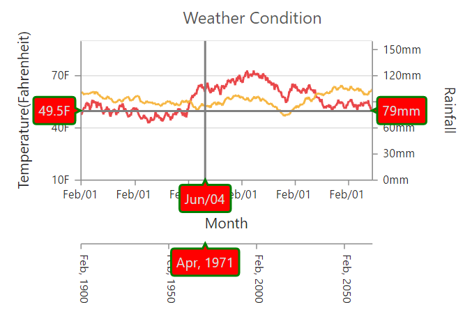
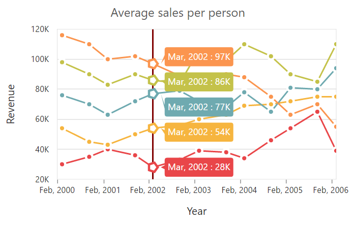
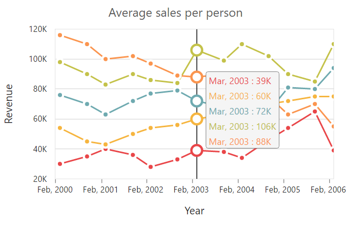
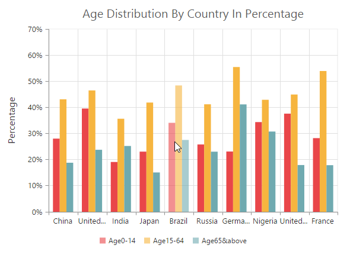
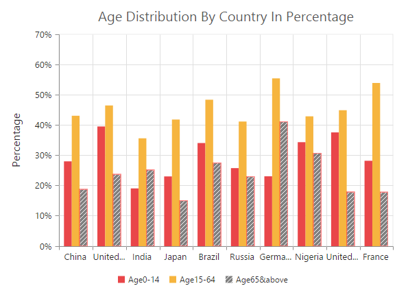

# User Interactions

## Tooltip

### Enable tooltip for data point

Tooltip for the data points can be enabled by using the [`visible`](../api/ejchart#members:series-tooltip-visible) option of the [`tooltip`](../api/ejchart#members:series-tooltip) in the series.



/// <reference path="tsfiles/jquery.d.ts" />
/// <reference path="tsfiles/ej.web.all.d.ts" />

module ChartComponent {
    $(function () {
        var chartsample = new ej.datavisualization.Chart($("#chartcontainer"), {
            // ...           
            series: [{
                  
                  //...
                  //Enable tooltip for the series
                  tooltip: {visible: true}	
              }],
           // ...
           
        });
    });
}



### Format the tooltip 

Tooltip displays data specified by the [`format`](../api/ejchart#members:series-tooltip-format) option of the tooltip. The default value of the format option is * **#point.x# : #point.y#** *. Here, * **#point.x#** * is the placeholder for x value of the point and * **#point.y#** * is the placeholder for y value of the point.

You can also use * **#series.<optionname>#** * as placeholder to display the value of an option in corresponding series and use * **#point.<optionname>#** * as place holder to display the value of an option in the corresponding point.



        var chartsample = new ej.datavisualization.Chart($("#chartcontainer"), {
            // ...
            series: [{
                 tooltip: {
                       //Displaying tooltip in a format
                       format: "#series.name#   #point.x# : #point.y#  (g/kWh)"	
                       // ...
                 } 
              }],
            // ...
        });



### Tooltip Template

HTML elements can be displayed in the tooltip by using the [`template`](../api/ejchart#members:series-tooltip-template) option of the tooltip. The template option takes the value of the id attribute of the HTML element. You can use the * **#point.x#** * and * **#point.y#** * as place holders in the HTML element to display the x and y values of the corresponding data point. 

You can also use * **#series.<optionname>#** * as place holder to display the value of an option in corresponding series of the tooltip and use * **#point.<optionname>#** * as place holder to display the value of an option in the corresponding point for which the tooltip is displayed.
  



<body>
   

    <!-- Create Tooltip template here -->
    

              
 
 
  

        

            

               <label id="efpercentage">&nbsp;#point.y#% </label>
               <label id="ef">Efficiency </label>
            

        

    

</body>



#### Tooltip template animation

You can enable animation by setting the [`enableAnimation`](../api/ejchart#members:series-tooltip-enableanimation) to true. Tooltip animates when the mouse moves from one data point to another point. The [`duration`](../api/ejchart#members:series-tooltip-duration) property in tooltip specifies the time taken to animate the tooltip. the duration is set to **"500ms"**, by default.

N> Tooltip is animated only if the template is specified for tooltip.



         var chartsample = new ej.datavisualization.Chart($("#chartcontainer"), {
            
            // ...
            series: [{
                  tooltip: {
                    //Enable tooltip template animation and set duration time
                    enableAnimation: true, duaration: "1000ms",                                      
                    // ...
                 }
             }],
             
            // ...
        });



### Customize the appearance of tooltip   

The [`fill`](../api/ejchart#members:series-tooltip-fill) and [`border`](../api/ejchart#members:series-tooltip-border) options are used to customize the background color and border of the tooltip respectively. The [`font`](../api/ejchart#members:series-tooltip-font) option in the tooltip is used to customize the font of the tooltip text.



        var chartsample = new ej.datavisualization.Chart($("#chartcontainer"), {
            // ...
            series: [{
                 tooltip: {
                       //Change tooltip color and border
                       fill: '#FF9933',
                       border: { width: 1, color: "#993300" }	
                       // ...
                 } 
              }],
            // ...
        });



#### Tooltip with rounded corners

The options [`rx`](../api/ejchart#members:series-tooltip-rx) and [`ry`](../api/ejchart#members:series-tooltip-ry) are used to customize the corner radius of the tooltip rectangle.



         var chartsample = new ej.datavisualization.Chart($("#chartcontainer"), {
	        // ...             
	        series: [{
                 tooltip: {
                    //Customize the corner radius of the tooltip rectangle.
                    rx: "50", ry: "50"                            
                    // ...
                 }
              }],
	       // ... 
        });



## Zooming and Panning

### Enable Zooming

There are two ways you can zoom the chart,

* When the [`zooming.enable`](../api/ejchart#members:zooming-enable) option is set to true, you can zoom the chart by using the rubber band selection.

* When the [`zooming.enableMouseWheel`](../api/ejchart#members:zooming-enablemousewheel) option is set to true, you can zoom the chart on mouse wheel scrolling. 

* When [`zooming.enablePinching`](../api/ejchart#members:zooming-enablePinching) option is set to *true*, you can zoom the chart through pinch gesture.

N> Pinch zooming is supported only in browsers that support multi-touch gestures. Currently IE10, IE11, Chrome and Opera browsers support multi-touch in desktop devices.



         var chartsample = new ej.datavisualization.Chart($("#chartcontainer"), {
             //  ...             
	         //Enable zooming in chart
             zooming: {enable: true}
             // ...
        });



After zooming the chart, a zooming toolbar will appear with options to *zoom*, *pan* and *reset*. Selecting the Pan option will allow to pan the chart and selecting the Reset option will reset the zoomed chart.

### Types of zooming

The [`type`](../api/ejchart#members:zooming-type) option in zooming specifies whether the chart is allowed to scale along the horizontal axis or vertical axis or along both axis. The default value of the [`type`](../api/ejchart#members:zooming-type) is **"xy"** (both axis).



         var chartsample = new ej.datavisualization.Chart($("#chartcontainer"), {
             //  ...             
	         zooming: {
                    enable: true,
                    //Enable horizontal zooming
                    type: 'x'
                } 
             // ...
        });



### Customizing zooming toolbar

You can choose the items displayed in the zooming toolbar by specifying the property [`toolBarItems`](../api/ejchart#members:zooming-toolBarItems).



    var chartsample = new ej.datavisualization.Chart($("#chartcontainer"), {
             //  ...             
	         //Customizing zooming toolbar
	         zooming:{	
			   enable: true,
               toolbarItems: ["reset", "zoomIn", "zoomOut"]
			},
             // ...
    });



### Enable ScrollBar

EjChart provides scrollbar support to view the other portions of chart area which is not shown in the view port when zoomed, by setting true to [`enableScrollbar`](../api/ejchart#members:zooming-enablescrollbar) option in [`zooming`](../api/ejchart#members:zooming).  



     var chartsample = new ej.datavisualization.Chart($("#chartcontainer"), {
             //  ...             
	         //Enable zooming scrollbar  in chart
             zooming: {enable:true, enableScrollbar: true}
             // ...
     });



## Crosshair

Crosshair is used to view the value of an axis at mouse position or touch contact point. 

### Enable crosshair and crosshair label

Crosshair can be enabled by using the [`visible`](../api/ejchart#members:series-tooltip-visible) option in the [`crosshair`](../api/ejchart#members:crosshair). Crosshair label for an axis can be enabled by using the [`visible`](../api/ejchart#members:primaryxaxis-crosshairlabel-visible) option of [`crosshairLabel`](../api/ejchart#members:primaryxaxis-crosshairlabel) in the corresponding axis.



        var chartsample = new ej.datavisualization.Chart($("#chartcontainer"), {
            // ...             
            primaryXAxis:{
                //Enable crosshairLabel to X-Axis
                crosshairLabel: { visible: true },
            },

            primaryYAxis:{
                //Enable crosshairLabel to Y-Axis
                crosshairLabel: { visible: true },
            },
           
           //Initializing Crosshair
            crosshair:{
                visible: true
            },
            // ...             

        });



### Customize the crosshair line and crosshair label

The [`fill`](../api/ejchart#members:crosshair-fill) and [`border`](../api/ejchart#members:crosshair-border) options of the [`crosshairLabel`](../api/ejchart#members:crosshairlabel) is used to customize the background color and border of the crosshair label respectively. Color and width of the crosshair line can be customized by using the [`line`](../api/ejchart#members:crosshair-line) option in the [`crosshair`](../api/ejchart#members:crosshair).



         var chartsample = new ej.datavisualization.Chart($("#chartcontainer"), {
             // ...             
             primaryXAxis: {
                     //...
                     crosshairLabel: {
                          visible: true,
                          //Customizing the crosshair label background color and border
                          fill: "red", 
                          border: { color: "green", width: 2 }
                      }
              },
               
              crosshair: {
                   visible: true,
                   //Customizing the crosshair line
                   line: { color: 'gray', width: 2 },
              } 
            // ...
        });



## Trackball

Trackball is used to track a data point close to the mouse position or touch contact point. Trackball marker indicates the closest point and trackball tooltip displays the information about the point.

### Enable Trackball

Trackball can be enabled by setting the [`visible`](../api/ejchart#members:crosshair-visible) option of the crosshair to *true* and then set the [`type`](../api/ejchart#members:crosshair-type) as **"trackball"**. The default value of type is **"crosshair"**.



        var chartsample = new ej.datavisualization.Chart($("#chartcontainer"), {
	
             crosshair: {
                   visible: true,
                   //Change crosshair type to trackball
                   type: 'trackball',
                  } 
           //......
           });



#### Customize trackball marker and trackball line

Shape and size of the trackball marker can be customized by using the [`shape`](../api/ejchart#members:crosshair-marker-shape) and [`size`](../api/ejchart#members:crosshair-marker-size) options of the crosshair marker. Color and width of the trackball line can be customized by using the [`line`](../api/ejchart#members:crosshair-line) option in the crosshair.



       var chartsample = new ej.datavisualization.Chart($("#chartcontainer"), {  
	
             // ...
             crosshair: {
                  visible: true,

                  //Customize the trackball line color and width
                  line: { color: '#800000', width: 2 },

                  //Customize the trackball marker shape size and visibility
                  marker: {
                       shape: 'pentagon',
                       size: {
                            height: 9, width: 9
                         },
                       //Enable/disable trackball marker
                       visible: true
                    }     
                } 
              // ...
           });



### Format Trackball tooltip

X and Y values displayed in the trackball tooltip are formatted based on its axis [`labelFormat`](../api/ejchart#members:primaryxaxis-labelformat).  



        var chartsample = new ej.datavisualization.Chart($("#chartcontainer"), {
	
              // ...
              primaryXAxis: {
                   labelFormat: 'MMM, yyyy',
                   //...
               },
              
              primaryYAxis: {
                    labelFormat: '{value}K',
                    //...
               },
               
               crosshair: {
                    visible: true,
                    type: 'trackball',                           
                }
                  // ...
           });



You can able to show the trackball tooltip in two modes, using trackballTooltipSettings.

                1.	Grouping.
                2.	Float. 



            var chartsample = new ej.datavisualization.Chart($("#chartcontainer"), {
                // ... 
                    crosshair: {
                        visible: true,
                        type: 'trackball',
                        //Customize the trackball tooltip
                        trackballTooltipSettings: {
                            //Trackball mode
                            mode: 'grouping',
                            //Customize the trackball border, fill, rx and ry               
                                border:{ 
                                    width:1,
                                    color: 'grey'
                                },
                            rx: 3,
                            ry: 3,
                            fill: 'whitesmoke'
                        }
                     }
         // ... });



#### Trackball tooltip template:
Trackball tooltip template is used to display the tooltip in customized template format. You can define the desired template in css style. You can enable the **toolTipTemplate**  by using the following code snippet.



            var chartsample = new ej.datavisualization.Chart($("#chartcontainer"), {
                // ... 
                    crosshair: {
                        visible: true,
                        type: 'trackball',
                        //Customize the trackball tooltip
                        trackballTooltipSettings: {
                            //Trackball mode
                            mode: 'float',
                            toolTipTemplate: 'template'
                        }
                     }
         // ... });



## Highlight

EjChart provides highlighting support for the series and data points on mouse hover. To enable the highlighting option, set the [`enable`](../api/ejchart#members:series-highlightsettings-enable) property to *true* in the [`highlightSettings`](../api/ejchart#members:series-highlightsettings) of the series.

N> When hovering mouse on the data points, the corresponding series legend also will be highlighted.



       var chartsample = new ej.datavisualization.Chart($("#chartcontainer"), {
	
              // ...
              series:[{
                  
                    highlightSettings: {
                        
                         // enable the highlight settings
                         enable: true,
                     },
                    // ... 
               }]       
                    
               // ...
           });



### Highlight Mode

You can set three different highlight mode for the highlighting data point and series by using the [`mode`](../api/ejchart#members:series-highlightsettings-mode) property of the [`highlightSettings`](../api/ejchart#members:series-highlightsettings).

* Series
* Points
* Cluster

**Series mode**

To highlight all the data points of the specified series, you can set the **"series"** value to the [`mode`](../api/ejchart#members:series-highlightsettings-mode) option in the highlightSettings. 



        var chartsample = new ej.datavisualization.Chart($("#chartcontainer"), {
	
              // ...
              series:[{
                  
                    highlightSettings: {
                        enable: true, 
                        
                        //Change highlight mode
                        mode: 'series'

                     },
                    // ... 
               }]       
                    
               // ...
           });



**Point mode**

To highlight a single point, you can set the **"point"** value to the [`mode`](../api/ejchart#members:series-highlightsettings-mode) option.



        var chartsample = new ej.datavisualization.Chart($("#chartcontainer"), {
	
              // ...
              series:[{
                  
                    highlightSettings: {
                        enable: true, 
                        
                        //Change highlight mode
                        mode: 'point'

                     },
                    // ... 
               }]       
                    
               // ...
           });



**Cluster mode**

To highlight the points that corresponds to the same index in all the series, set the **"cluster"** value to the [`mode`](../api/ejchart#members:series-highlightsettings-mode) option.



        var chartsample = new ej.datavisualization.Chart($("#chartcontainer"), {
	
              // ...
              series:[{
                  
                    highlightSettings: {
                        enable: true, 
                        
                        //Change highlight mode
                        mode: 'cluster'

                     },
                    // ... 
               }]       
                    
               // ...
           });



### Customize the highlight styles

To customize the highlighted series, use the [`color`](../api/ejchart#members:series-highlightsettings-color), [`border`](../api/ejchart#members:series-tooltip-border) and [`opacity`](../api/ejchart#members:series-highlightsettings-opacity) options in the highlightSettings.



        var chartsample = new ej.datavisualization.Chart($("#chartcontainer"), { 
	
              // ...
              series:[{
                  
                    highlightSettings: {
                        enable: true, 
                        
                        //Customizing 
                        border: { width: '1.5', color: "red" },
                        opacity: 0.5, color: "green"
                     },
                    // ... 
               }]       
                    
               // ...
           });



### Patterns to highlight

EjChart provides pattern support for highlighting the data by setting the value to the [`pattern`](../api/ejchart#members:series-highlightsettings-pattern) property of the highlightSettings. The different types of highlight patterns are as follows.

1.	chessboard
2.	crosshatch
3.	dots
4.	pacman
5.	grid
6.	turquoise
7.	star
8.	triangle
9.	circle
10.	tile
11.	horizontalDash
12.	verticalDash
13.	rectangle
14.	box
15.	verticalStripe
16.	horizontalStripe
17.	bubble
18.	diagonalBackward
19.	diagonalForward



        var chartsample = new ej.datavisualization.Chart($("#chartcontainer"), {  
	
              // ...
              series:[{
                  
                    highlightSettings: {
                        enable: true, 
                        
                        //Change highlighting pattern
                         pattern: "chessboard",

                     },
                    // ... 
               }]       
                    
               // ...
           });



#### Custom pattern

To create a custom pattern for the highlighting data points, set the pattern type as **"custom"** and add the custom pattern **id** in the [`customPattern`](../api/ejchart#members:series-highlightsettings-custompattern) option of the highlightSettings.



<body>
    

            <svg>
                <pattern id="dots_a" patternUnits="userSpaceOnUse" width="6" height="6">
                    <rect x="0" y="0" width="6" height="6" transform="translate(0,0)" fill="black" opacity="1"></rect>
                    <path d='M 3 -3 L -3 3 M 0 6 L 6 0 M 9 3 L 3 9'stroke-width="1" stroke="white"></path>
                </pattern>
            </svg>

</body>



## Selection

EjChart provides selection support for the series and data points on mouse click. To enable the selection option, set the [`enable`](../api/ejchart#members:series-selectionsettings-enable) property to *true* in the [`selectionSettings`](../api/ejchart#members:series-selectionSettings) of the series.

N> When mouse is clicked on the data points, the corresponding series legend also will be selected.



        var chartsample = new ej.datavisualization.Chart($("#chartcontainer"), {  
	
              // ...
              series:[{
                  
                   selectionSettings: {
                         // enable the selection settings
                         enable: true, 
                      },
                    // ... 
               }]       
                    
               // ...
           });



  

### Selection Mode

You can set four different selection mode for highlighting the data point and series by using the [`mode`](../api/ejchart#members:series-selectionsettings-mode) property of the selectionSettings.

* Series
* Points
* Cluster
* Range

**Series mode**

To select all the data points of the specified series, you can set the **"series"** value to the [`mode`](../api/ejchart#members:series-selectionsettings-mode) option in the selectionSettings.



        var chartsample = new ej.datavisualization.Chart($("#chartcontainer"), {
	
              // ...
              series:[{
                  
                   selectionSettings: {
                         enable: true, 
                         
                        //Change selection mode
                         mode: 'series',
                         pattern: 'chessboard'
                      },
                    // ... 
               }]       
                    
               // ...
           });



**Point mode**

To highlight a single point, you can set the **"point"** value to the [`mode`](../api/ejchart#members:series-selectionsettings-mode) option. 



       var chartsample = new ej.datavisualization.Chart($("#chartcontainer"), {  
	
              // ...
              series:[{
                  
                   selectionSettings: {
                         enable: true, 
                         
                        //Change selection mode
                         mode: 'point',
                         // ...
                      },
                    // ... 
               }]       
                    
               // ...
           });



**Cluster mode**

To select the points that corresponds to the same index in all the series, set the **"cluster"** value to the [`mode`](../api/ejchart#members:series-selectionsettings-mode) option.



        var chartsample = new ej.datavisualization.Chart($("#chartcontainer"), {  
	
              // ...
              series:[{
                  
                   selectionSettings: {
                         enable: true, 
                         
                        //Change selection mode
                         mode: 'cluster',
                         // ...
                      },
                    // ... 
               }]       
                    
               // ...
           });



**Range mode**

To fetch the selected area data points value, you can set the selectionSettings [`mode`](../api/ejchart#members:series-selectionsettings-mode) as **range** in the chart series. The selection rectangle can be drawn as horizontally, vertically or in both direction by using [`rangeType`](../api/ejchart#members:series-selectionsettings-rangetype) property and the selected data’s are returned as an array collection in the [`rangeSelected`](../api/ejchart#events:rangeselected) event.  



        var chartsample = new ej.datavisualization.Chart($("#chartcontainer"), {
                    // ...
                    series:[{
                  
                        selectionSettings: {
                            enable: true, 
                         
                            //Change selection mode
                            mode: 'range',

                            //Enable both axis selection
                            rangeType:'xy'

                            // ...
                        }, 

                        // ... 
                    }],
                 //Subscribe the rangeSelected event. 
                 rangeSelected: "rangeSelection"  
                 // ...
           });

         //event to fetch the selected data point values
         rangeSelection:function (sender){
            var selectedData = sender.data.selectedDataCollection;
            //...
         }



### Selection Type

You can set two different selection type for selecting the data point and series on mouse click by using the [`type`](../api/ejchart#members:series-selectionsettings-type) property of the selectionSettings. 

* Single 
* Multiple 

**Single Type**

To select a data point or a series on mouse click based on the [`selectionSettings.mode`](../api/ejchart#members:series-selectionsettings-mode), set [`selectionSettings.type`](../api/ejchart#members:series-selectionsettings-type) as **"single"** in the series.



       var chartsample = new ej.datavisualization.Chart($("#chartcontainer"), {  
	
              // ...
              commonSeriesOptions:{
                  			    
			    selectionSettings: {
			        enable: true,
                    //Selection mode is series or point ,cluster
			        mode: 'series',
                    //Selection type is single
			        type: 'single'
			    },
			}
 
               // ...
       });



**Multiple Type**

For selecting multiple data points or series on mouse click, set [`selectionSettings.type`](../api/ejchart#members:series-selectionsettings-type) as **"multiple"** in the series.



        var chartsample = new ej.datavisualization.Chart($("#chartcontainer"), { 
	
              // ...
              commonSeriesOptions:{
                  			    
			    selectionSettings: {
			        enable: true,
                    //Selection mode is series or point ,cluster
			        mode: 'series',
                    //Selection type is multiple
			        type: 'multiple'
			    },
			}
 
               // ...
       });



### Customizing selection styles

To customize the selection styles, use the [`color`](../api/ejchart#members:series-selectionsettings-color), [`border`](../api/ejchart#members:series-selectionsettings-border) and [`opacity`](../api/ejchart#members:series-selectionsettings-opacity) options in the selectionSettings.



       var chartsample = new ej.datavisualization.Chart($("#chartcontainer"), {
	
              // ...
              series:[{
                  
                   selectionSettings: {
                         enable: true, 
                         
                        //Customizing selection rectangle styles
                         border: { width: '1.5', color: "red" },
                         opacity: 0.5, color: "red"
                         // ...
                      },
                    // ... 
               }]       
                    
               // ...
           });



### Patterns for selection

EjChart provides pattern support for the data selection by setting the value to the [`pattern`](../api/ejchart#members:series-selectionsettings-pattern) property of the selectionSettings. The different types of selection patterns are as follows.

1.	chessboard
2.	crosshatch
3.	dots
4.	pacman
5.	grid
6.	turquoise
7.	star
8.	triangle
9.	circle
10.	tile
11.	horizontalDash
12.	verticalDash
13.	rectangle
14.	box
15.	verticalStripe
16.	horizontalStripe
17.	bubble
18.	diagonalBackward
19.	diagonalForward



        var chartsample = new ej.datavisualization.Chart($("#chartcontainer"), { 
	
              // ...
              series:[{
                  
                   selectionSettings: {
                         enable: true, 
                         
                        //Change selection pattern
                         pattern: "diagonalForward",
                         // ...
                      },
                    // ... 
               }]       
                    
               // ...
           });



#### Custom pattern

To create a custom pattern for selecting the data points, set the [`pattern`](../api/ejchart#members:series-selectionsettings-pattern) type as **"custom"** and add the custom pattern **id** in the [`customPattern`](../api/ejchart#members:series-selectionsettings-custompattern) option of the selectionSettings.



<body>
    

            <svg>
                <pattern id="dots_a" patternUnits="userSpaceOnUse" width="6" height="6">
                    <rect x="0" y="0" width="6" height="6" transform="translate(0,0)" fill="black" opacity="1"></rect>
                    <path d='M 3 -3 L -3 3 M 0 6 L 6 0 M 9 3 L 3 9'stroke-width="1" stroke="white"></path>
                </pattern>
            </svg>

</body>



### Handling Series Selection

To get the series information when selecting the specific series, subscribe to the [`seriesRegionClick`](../api/ejchart.html#events:seriesregionclick) event and set the **selectionSettings.mode** as **"series"**.



       var chartsample = new ej.datavisualization.Chart($("#chartcontainer"), {
	
             // ... 
              series:[{
                selectionSettings: [{
                    enable: true,
                    //Change selection mode
                    mode: "series",
                    // ...
                }],
           
           //Subscribe series selection event
           seriesRegionClick: "seriesSelection",
            // ... 
        });

        function seriesSelection(sender) {
            //Get Series information on series selection
            var seriesData = sender.series;
        }



### Selection on Load

We can able to select the point/series programmatically on chart load, by setting series and point index in the selectedDataPointIndexes property.



        var chartsample = new ej.datavisualization.Chart($("#chartcontainer"), { 
	
             // ... 
           
           //Added selected data point indexes

           selectedDataPointIndexes: [
               { seriesIndex:0 , pointIndex:2 },
               { seriesIndex:1 , pointIndex:4 }
           ],
            
            // ...

        });



## Data Editing

EjChart provides support to change the location of the rendered points. This can be done by dragging the point and dropping it on another location in chart. To enable the data editing, set the [`enable`](../api/ejchart#members:series-dragSettings-enable) property to true in the [`dragSettings`](../api/ejchart#members:series-dragSettings) of the series.



 var chartsample = new ej.datavisualization.Chart($("#chartcontainer"), {	  
      //Initializing Series
      series:[{     
              dragSettings:{     
		        enable: true
		}
           }]   
     });



### Customize Dragging direction

To drag the point along x and y axes, you can specify [`type`](../api/ejchart#members:series-dragSettings-type) as xy in dragSettings. And to drag along x axis alone, specify the type as x and to drag along y axis, specify type as y.



 var chartsample = new ej.datavisualization.Chart($("#chartcontainer"), {
  {	  
      //Initializing Series
      series:[{     
              dragSettings:{     
		        type: 'y'
		}
           }]   
     });



