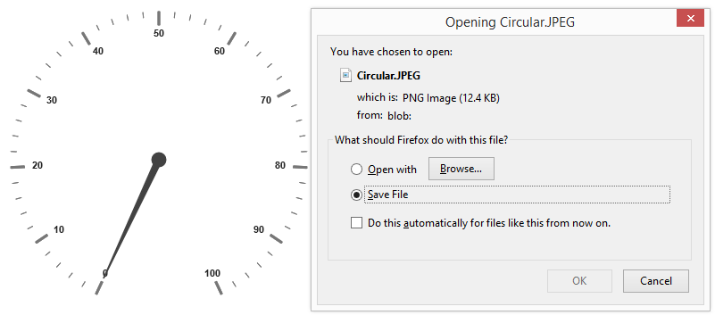

# Exporting

**Circular Gauge** has an exporting feature that converts **Gauge** control into image format and then export in client side. The method API `exportImage` is used to export the **Circular Gauge**. It has two arguments such as **file name** and **file format** to specify the file name and file formats. For exporting refer the following code example.



<input type="submit" value="Export Image" id="buttonExportImage">
    

    
FileName 

    
FileFormat 

</input>
<select id="Select1">
    <option value="JPEG">JPEG</option>
    <option value="PNG">PNG</option>
</select>





$(function () {
        var circularGaugeSample = new ej.datavisualization.CircularGauge($("#circularGauge"));
        var basicButton = new ej.Button($("#buttonExportImage"), {
            width: "100px", click: "buttonClickEvent", 
            });
    });
    function buttonClickEvent() {
        var FileName = $("#txtFileName").val();
        var FileFormat = $("#ddFileType").val();
         var circularGaugeSample = new ej.datavisualization.CircularGauge($("#circularGauge"));
         circularGaugeSample.exportImage(FileName,FileFormat);
        
    }



Execute the above code to render the following output.

