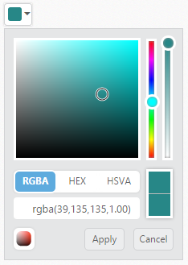
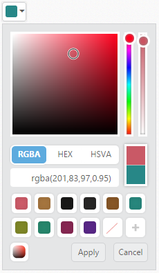
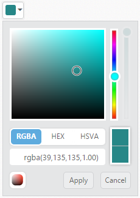
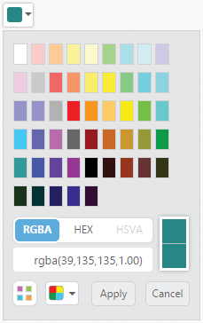

# Behavior Settings

## showPreview

The **ColorPicker** control provides live preview support for current cursor selection color and selected color. **showPreview** property allows you to preview the selected color in the picker or from the palette.

The **showPreview** property is Boolean type and its default value is true.

In the **HTML** page, add a **&lt;input&gt;** element to render **ColorPicker** widget



        <input id="colorpick" type="text" />
        



* Create app.ts file and use the below content



            /// <reference path="jquery.d.ts" />  
            /// <reference path="ej.web.all.d.ts" />

            module ColorPickerComponent {
                var colorPickObj = new ej.ColorPicker($("#colorpick"), {
                        value: "#278787",
                        showPreview: true
                    })
            }



The following screenshot displays the output of the above code example.

 

## showRecentColors

The **ColorPicker** control allows you to store the color values in custom list by using **showRecentColors** property. The **ColorPicker** keeps up to 11 colors in a custom list. By clicking the add button, the selected color from picker or palette gets added in the recent color list.  

The **showRecentColors** property is Boolean type and its default value is false.

In the **HTML** page, add a **&lt;input&gt;** element to render **ColorPicker** widget.



        <input id="colorpick" type="text" />
        



* Create app.ts file and use the below content



        /// <reference path="jquery.d.ts" />  
        /// <reference path="ej.web.all.d.ts" />

        module ColorPickerComponent {
            var colorPickObj = new ej.ColorPicker($("#colorpick"), {
                    value: "#278787",
                    showRecentColors: true
                })
        }



The following screenshot displays the output of the above code example.

 

## enableOpacity

The **ColorPicker** control allows you to enable or disable the opacity slider. You can achieve this by using the **enableOpacity** property. 

The **enableOpacity** property is Boolean type and its default value is true.

In the **HTML** page, add a **&lt;input&gt;** element to render **ColorPicker** widget



        <input id="colorpick" type="text" />
        



* Create app.ts file and use the below content



        /// <reference path="jquery.d.ts" />  
        /// <reference path="ej.web.all.d.ts" />

        module ColorPickerComponent {
            var colorPickObj = new ej.ColorPicker($("#colorpick"), {
                    value: "#278787",
                    enableOpacity: false
                })
        }



The following screenshot displays the output of the above code example.

 

## columns

The palette model consists of color values in the rows and columns order. Palette only consists of predefined colors and allows you to select anyone color from it. The **columns** property allows you to modify the number of columns in palette model. 

The **columns** property is Number type and its default value is 10.

In the **HTML** page, add a **&lt;input&gt;** element to render **ColorPicker** widget



        <input id="colorpick" type="text" />
        



* Create app.ts file and use the below content



        /// <reference path="jquery.d.ts" />  
        /// <reference path="ej.web.all.d.ts" />

        module ColorPickerComponent {
            var colorPickObj = new ej.ColorPicker($("#colorpick"), {
                    value: "#278787",
                    columns: 9
                })
        }



The following screenshot displays the output of the above code example.

 

