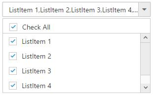
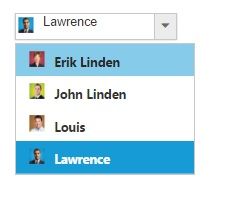
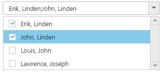
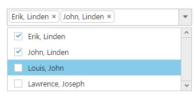

# How To section in TypeScript DropDownList

## Set focus to control initially?

[Access key](https://en.wikipedia.org/wiki/Access_key) property can be added in input element to set focus. Here focus is set by using access key + "j".



     <input type="text" id="dropdown1" />
     




/// <reference path="tsfiles/jquery.d.ts" />
/// <reference path="tsfiles/ej.web.all.d.ts" />
   module DropDownListComponent {
            var items = [
              { text: "ListItem 1", value: "item1" },
	          { text: "ListItem 2", value: "item2" },
		      { text: "ListItem 3", value: "item3" },
		      { text: "ListItem 4", value: "item4" },
		      { text: "ListItem 5", value: "item5" }
            ];
        $(function () {     
            var sample = new ej.DropDownList($("#dropdown1"),{   
                dataSource: items,
                fields: { text: "text", value: "value" }
            });
        //Control focus key
        $(document).on("keydown", function (e) {
            if (e.altKey && e.keyCode === 74) { // j- key code.
                $("#dropdown1_wrapper").focus();
            }
          });
       });
   }


## Clear the text of DropDownList input?

To clear the text of the DropDownList input, you can use [clearText](https://help.syncfusion.com/api/js/ejdropdownlist#methods:cleartext) method.

## Add an item dynamically to the DropDownList?

You can use [addItem](https://help.syncfusion.com/api/js/ejdropdownlist#methods:additem) method to add single or multiple items dynamically to the popup list. You can define all the possible values that is supported by field property such as text, value, id, HTML attributes, selected, image and its associated attributes such as alt, width, and height etc..,

Adding text and value is demonstrated in the below given sample,



     <input type="text" id="dropdown1" />
     



/// <reference path="tsfiles/jquery.d.ts" />
/// <reference path="tsfiles/ej.web.all.d.ts" />
   module DropDownListComponent {
            var items = [
              { text: "ListItem 1", value: "item1" },
	          { text: "ListItem 2", value: "item2" },
		      { text: "ListItem 3", value: "item3" },
		      { text: "ListItem 4", value: "item4" },
		      { text: "ListItem 5", value: "item5" }
            ];
      $(function () {
             var sample = new ej.DropDownList($("#dropdown1"),{  
                dataSource: items,
                fields: { text: "text", value: "value" }
            });

            $('#dropdown1').ejDropDownList("addItem", { text: "New Text", value: "text1" });

        });
   }


## Disable/ Enable the DropDownList widget?

You can enable or disable the DropDownList widget using "enabled" property or methods. Detailed information is given [here](customization#enabledisable-the-widget).

## Control the popup visibility via methods in script showPopup ()/hidePopup ()?

By default popup list is shown on DropDownList button click but you can display the list initially by enabling the [showPopupOnLoad](https://help.syncfusion.com/api/js/ejdropdownlist#members:showpopuponload) property. You can also use [showPopup ()](https://help.syncfusion.com/api/js/ejdropdownlist#methods:showpopup) or [hidePopup ()](https://help.syncfusion.com/api/js/ejdropdownlist#methods:hidepopup) methods at run time to display or hide the popup list.

## Retrieve the selected item data from select event via arguments?

Bind the select event and you can retrieve the value from args.value. 



     <input type="text" id="dropdown1" />
     




/// <reference path="tsfiles/jquery.d.ts" />
/// <reference path="tsfiles/ej.web.all.d.ts" />
   module DropDownListComponent {
            var items = [
              { text: "ListItem 1", value: "item1" },
	          { text: "ListItem 2", value: "item2" },
		      { text: "ListItem 3", value: "item3" },
		      { text: "ListItem 4", value: "item4" },
		      { text: "ListItem 5", value: "item5" }
            ];
    $(function () {       
        var sample = new ej.DropDownList($("#dropdown1"),{  
                dataSource: items,
                fields: { text: "text", value: "value" },
                select: function (args) {
                    console.log("Value is " + args.value);
                }
            });
        });
    }



The following screenshot will exhibit the select event arguments details,

## Append custom HTML in DropDownList popup outside the scroller part?

Create a custom HTML element and insert it after popup wrapper. Detailed sample is given [here](http://jsplayground.syncfusion.com/ey2mpity)

## Add check all option in popup list?

You can use [headerTemplate](https://help.syncfusion.com/api/js/ejdropdownlist#members:headertemplate) property to add any HTML element. Code snippet to add check all option is given below,



     <input type="text" id="dropdown1" />
	 




        .temp {
            height: 30px;
            display: block;
            padding-left: 13px;
            padding-top: 5px;
            border-bottom: 1px solid #c8c8c8;
        }
        .e-chkbox-wrap .e-text {
            font-size: 14px;
            padding-left: 10px;
        }

     




/// <reference path="tsfiles/jquery.d.ts" />
/// <reference path="tsfiles/ej.web.all.d.ts" />
   module DropDownListComponent {
            var items = [
              { text: "ListItem 1", value: "item1" },
	          { text: "ListItem 2", value: "item2" },
		      { text: "ListItem 3", value: "item3" },
		      { text: "ListItem 4", value: "item4" },
		      { text: "ListItem 5", value: "item5" }
            ];
     $(function () {   
            var sample = new ej.DropDownList($("#dropdown1"),{  
                width: 300,
                dataSource: items,
                fields: { text: "text", value: "value" },
                showCheckbox: true,
                headerTemplate: "
<input id ='check' type='checkbox'  />   
"
            });
            $("#check").ejCheckBox({ text: "Check All", change: "Change" });
        });
   }  
        function Change(args) {
            window.flag = true;
            var obj = $("#dropdown1").ejDropDownList("instance");
            if (args.isChecked) obj.checkAll();
            else obj.uncheckAll();
            window.flag = false;
        }



The following screenshot exhibits the output of the above code,

## To remove the items from DropDownList?

You can remove the items from the DropDownList  by using [splice](http://www.tutorialspoint.com/javascript/array_splice.htm#) method and then rebind the data source through set model. 
Removing an entry from DropdownList is demonstrated in the below given sample.


<input id="dropdown1" /> <button id="remove">Remove items</button>
    
   


/// <reference path="tsfiles/jquery.d.ts" />
/// <reference path="tsfiles/ej.web.all.d.ts" />
   module DropDownListComponent {
            var data = [
              { text: "ListItem1", value: "item1" },
              { text: "ListItem2", value: "item2" },
              { text: "ListItem3", value: "item3" },
              { text: "ListItem4", value: "item4" },
              { text: "ListItem5", value: "item5" }
            ];
            // create DropDownList from input HTML element
     $(function () {   
            var sample = new ej.DropDownList($("#dropdown1"),{  
                dataSource: data
            });
            $("#remove").click(function () {
                object = $("#dropdown1").data("ejDropDownList");
                data1 = object.model.dataSource.splice(0);
                data1.splice(0, 1);
                object.setModel({ dataSource: data1 });
            });
        });
   }  
  
The following screenshot exhibits the output of above code:

Before removing an item:

After removing an item:

## Select the image rather than the text from the DropDownList when the template concept is used?

By default, the DropDownList displays only the text of the data item. We can able to customize the selected data to show case the custom visual element in the DropDownList’s input element.

Initialize the DropDownList as follows



    <input type="text" id="List " />

/// <reference path="tsfiles/jquery.d.ts" />
/// <reference path="tsfiles/ej.web.all.d.ts" />
 module DropDownListComponent {
    //DataSource
    var List = [
    { text: "Erik Linden", image: "3", designation: "Representative", country: "England" }, 
    { text: "John Linden", image: "6", designation: "Representative", country: "Norway" },
    { text: "Louis", image: "7", designation: "Representative", country: "Australia" }, 
    { text: "Lawrence", image: "8", designation: "Representative", country: "India" }];

    //DropDownList Initialization

    $(function () {
       var sample = new ej.DropDownList($("#List"),{  
            dataSource: List,
            fields: { text: "text", value: "image" },
            width : "80px"
            popupWidth: 200 ,
            watermarkText: "Select an employee",
            template: '
' +
                        '
 ${text} 

',
            select: "onSelect"
        });
    });
   } 
    

Upon selecting the items from the DropDownList, the client side event “select” will be triggered, in that find the input element which holds the text value and make it as “hidden” and then create the span element for the custom value and append to the DropDownList outer wrapper element.



function onSelect(args){
        
    if(!args.model.showCheckbox && args.model.multiSelectMode == "none"){
         var imgLocation = "http://js.syncfusion.com/demos/web/images/Employee/" + args.value + ".png";
         if($("#myImg").length != 1){
             var target = $("#selectCar");
             $(target).css({display : "none"});
             var dateSpan = document.createElement('span');
             dateSpan.innerHTML = '';
              $(dateSpan).insertBefore(target);
          }
          else{

              edit_save = document.getElementById("myImg");
              edit_save.src = imgLocation;     
          }
    }
     


Apply the following styles 



    



N> This scenarios, will be suits for the single select mode in the DropDownList.

## Apply HTML Attributes such as color and class directly to the input element rather than the outer wrapper element of DropDownList?

By default, htmlAttributes property of DropDownList, will add the HTML attributes to the input element of DropDownList. But, the following attributes such as class, style, readOnly and disabled cannot add directly to the input element.

This can be achieved, by adding the attributes directly to the input element if you needed.



    <input type="text" id="dropdown1" />
    
/// <reference path="tsfiles/jquery.d.ts" />
/// <reference path="tsfiles/ej.web.all.d.ts" />
 module DropDownListComponent {
   //Data Source
        var List = [
            { text: "Erik Linden", role: "Representative", country: "England" },
            { text: "John Linden", role: "Representative", country: "Norway" },
            { text: "Louis", role: "Representative", country: "Australia" },
            { text: "Lawrence", role: "Representative", country: "India" }
        ];
        //DropDownList Initialization
    $(function () {
       var data = new ej.DropDownList($("#List"),{  
            dataSource: List,
            fields: { text: "text", value: "country" },
            width: "200px"
        });
    
        data.element.attr("style", "background:yellow");
    });
 } 


 
 
## Add tooltip on hovering the DropDownList’s items?
 
 In order to get tooltip on hovering the DropDownList popup items, use htmlAttributes field in it. Generate a DataSource with a field for mapping the HtmlAttributes having the “title” attribute value, which will allow you to show the tooltip on hovering. The htmlAttributes field will set the HTML properties for the list items.
 
 
 
    

        
Select a bike

        <input type="text" id="bikeList" />
    

    <script type="text/javascript">

/// <reference path="tsfiles/jquery.d.ts" />
/// <reference path="tsfiles/ej.web.all.d.ts" />
 module DropDownListComponent {
        BikeList = [
            { id: "bk1", text: "Apache RTR", tooltip: { title: "Apache RTR" } },
            { id: "bk2", text: "CBR 150-R", tooltip: { title: "CBR 150-R" } },
            { id: "bk3", text: "CBZ Xtreme", tooltip: { title: "CBZ Xtreme" } },
            { id: "bk4", text: "Discover", tooltip: { title: "Discover" } },
            { id: "bk5", text: "Dazzler", tooltip: { title: "Dazzler" } },
            { id: "bk6", text: "Flame", tooltip: { title: "Flame" } },
            { id: "bk7", text: "Fazzer", tooltip: { title: "Fazzer" } },
            { id: "bk8", text: "FZ-S", tooltip: { title: "FZ-S" } },
            { id: "bk9", text: "Pulsar", tooltip: { title: "Pulsar" } },
            { id: "bk10", text: "Shine", tooltip: { title: "Shine" } },
            { id: "bk11", text: "R15", tooltip: { title: "R15" } },
            { id: "bk12", text: "Unicorn", tooltip: { title: "Unicorn" } }
        ];
    $(function () {
       var data = new ej.DropDownList($("#bikeList"),{  
            dataSource: BikeList,
            fields: { id: "id", text: "text", value: "text", htmlAttributes: "tooltip" }
        });
    });
 }

    



## Stop/Prevent the events (change/select) in the DropDownList?

The client side events such as “select” or “change” can be prevented in the DropDownList by using argument name called cancel.



    
Select a car

        <input type="text" id="selectCar" />
    

    <ul>
        <li>Audi A4</li>
        <li>Audi A5</li>
        <li>Audi A6</li>
        <li>Audi A7</li>
        <li>Audi A8</li>
    </ul>

    

    <button id="button21">Select</button>

/// <reference path="tsfiles/jquery.d.ts" />
/// <reference path="tsfiles/ej.web.all.d.ts" />
 module DropDownListComponent {
    $(function () {
        var target = new ej.DropDownList($("#carsList"),{  
            targetID: "carsList",
            width: "150px",
            select: "onSelect",
            change: “onSelect”
        });
    });
 }   


While selecting the items in the DropDownList, the select or change event will be triggered. In that, sets “true” to the cancel argument, which will prevent the further selecting of items in the DropDownList.



    function onSelect(args) {
        args.cancel = true;
    }
    


## How can I add items in ejDropDownList at the first place in list?

To add the item in the certain position, then we should clear the old dataSource and add the items in array using jQuery Splice() method and then should re-initialize the dataSource in DropDownList.

Initialize the DropDownList as follows



    

        <input type="text" id="dropdown" />
        

            <button type="button" onclick="dataPrepend()">PREPEND</button>
            <button type="button" onclick="dataAppend()">POSTPOND</button>
        

    

/// <reference path="tsfiles/jquery.d.ts" />
/// <reference path="tsfiles/ej.web.all.d.ts" />
 module DropDownListComponent {
        window.countries = [
            { text: "Algeria" },
            { text: "Argentina" },
            { text: "Armenia" },
            { text: "Brazil" },
            { text: "Bangladesh" }
        ];

        // Creates the DropDownList
    $(function () {
        var target = new ej.DropDownList($("#dropdown"),{  
            dataSource: window.countries,
            field: { text: "text" }
        });
    });
 } 
    


Upon clicking to the Prepend button, which will insert the items at index of “0” in the DropDownList.



    function dataPrepend() {
        var prepend = $('#dropdown').data("ejDropDownList");
        if (prepend.model.dataSource != null) {
            prepend.model.dataSource.splice(0, 0, { text: "India", value: "-1" });
            var b = prepend.model.dataSource;
            prepend.model.dataSource = null;
            prepend.option("dataSource", b);
        }
    }
    


If you click the postpone button, which insert items at the last index in the DropDownList.



    function dataAppend() {
        $('#dropdown').ejDropDownList("addItem", { text: "India" });
    }



## Can a DropDownList have delimiters in their JSON data source?

If the items have delimiter character, the same delimiter should not be set in the “delimiterChar” property of DropDownList. The default delimiter is “comma”. We suggest to use different delimiter character in the “delimiterChar” property of DropDownList if the multiSelectMode or showCheckbox is enabled.

Setting delimiter character other than comma will differentiate the selected items in DropDownList. Else you can use multiSelectMode as visualMode, so that each selected item in DropDownList will be boxed separately in the textbox.

Method 1: Setting custom delimiter Character



    <input type="text" id="List” />

/// <reference path="tsfiles/jquery.d.ts" />
/// <reference path="tsfiles/ej.web.all.d.ts" />
 module DropDownListComponent {
        var List = [
               { text: "Erik, Linden", designation: "Representative" },
               { text: "John, Linden",designation: "Dancer"},
               { text: "Louis, John", designation: "Professor"},
               { text: "Lawrence, Joseph", designation: "Software Engineer" }
        ];
        $(function () {
            var target = new ej.DropDownList($("#List"),{  
                dataSource: List,
                width: "100%",
                fields: { text: "text", value :"designation" },
                watermarkText: "Select an employee",
                multiSelectMode: "delimiter",
                delimiterChar : ";",
                showCheckbox: true
            });
        });
 }
    


Method 2: Using Visual Mode



    <input type="text" id=" List " />
/// <reference path="tsfiles/jquery.d.ts" />
/// <reference path="tsfiles/ej.web.all.d.ts" />
 module DropDownListComponent {
    var List = [
            { text: "Erik, Linden", designation: "Representative" },
            { text: "John, Linden", designation: "Dancer" },
            { text: "Louis, John", designation: "Professor" },
            { text: "Lawrence, Joseph", designation: "Software Engineer" }
    ];
    $(function () {
         var target = new ej.DropDownList($("#List"),{  
            dataSource: List,
            width: "100%",
            fields: { text: "text", value: "designation" },
            watermarkText: "Select an employee",
            multiSelectMode: "visualmode",
            showCheckbox: true
        });
    });
}
 

   
    