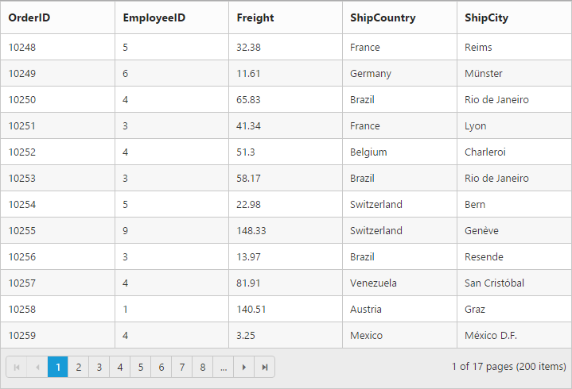
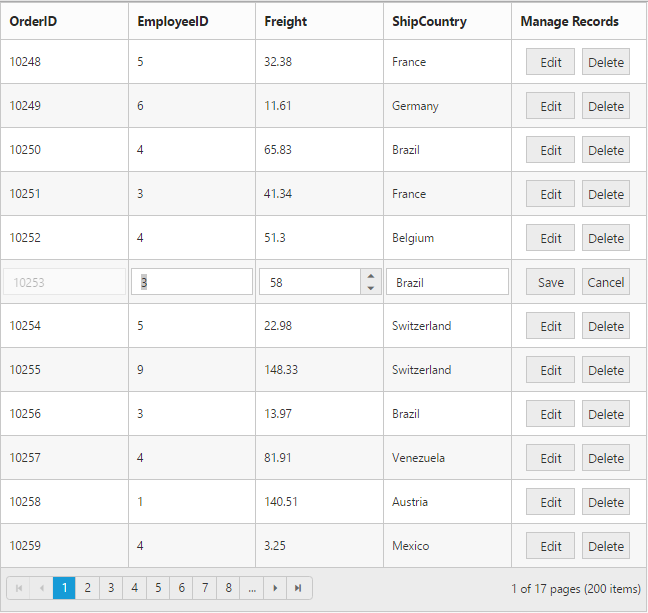
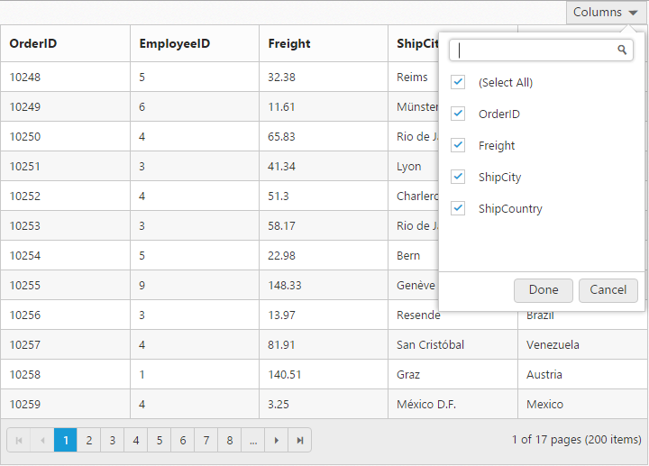
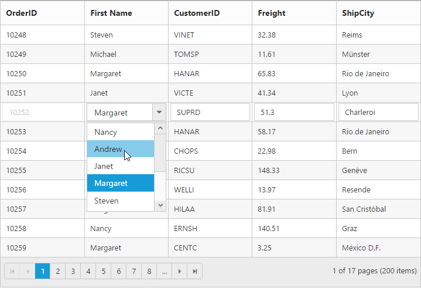

---
layout: post
title: Columns with Grid widget for Syncfusion Essential Typescript
description: How to define the columns and its features
platform: Typescript
control: Grid
documentation: ug
--- 
# Columns

Column definitions are used as the [`dataSource`](https://help.syncfusion.com/api/js/ejgrid#members:datasource "dataSource") schema in Grid and it plays vital role in rendering column values in required format. Grid operations such as sorting, filtering, editing would be performed based on the column definitions. The [`field`](https://help.syncfusion.com/api/js/ejgrid#members:columns-field "field") property of the [`columns`](https://help.syncfusion.com/api/js/ejgrid#members:columns "columns") is necessary to map the datasource values in Grid columns.

N> 1. If the column with [`field`](https://help.syncfusion.com/api/js/ejgrid#members:columns-field "field") is not in the datasource, then the column values will be displayed as empty.
N> 2. If the [`field`](https://help.syncfusion.com/api/js/ejgrid#members:columns-field "field") name contains "dot" operator then it is considered as complex binding.

## Column Template

HTML templates can be specified in the [`template`](https://help.syncfusion.com/api/js/ejgrid#members:columns-template "template") property of the particular column as a string (HTML element) or ID of the template's HTML element.

You can use JsRender syntax in the template. For more information about JsRender syntax, please refer [this link](http://www.jsviews.com/#jsrapi "this link"). 

N> If [`field`](https://help.syncfusion.com/api/js/ejgrid#members:columns-field "field") is not specified, you will not able to perform editing, grouping, filtering, sorting, search and summary functionalities in particular column.

The following code example describes the above behavior.







/// <reference path="tsfiles/jquery.d.ts" />
/// <reference path="tsfiles/ej.web.all.d.ts" />

module GridComponent {
    $(function () {
        var gridInstance = new ej.Grid($("#Grid"), {
            //The datasource "window.employeeView" is referred from 'http://js.syncfusion.com/demos/web/scripts/jsondata.min.js'
            dataSource: window["employeeView"],
                allowPaging: true,
                pageSettings: {
                    pageSize: 4
                },
                columns: [
                    { headerText: "Photo", template: "" },
                    { field: "EmployeeID" },
                    { field: "FirstName" },
                    { field: "LastName" },
                    { field: "Country" }
                ]       
      });
    });
}



The following output is displayed as a result of the above code example.

## Command Column

### Default action buttons

Using [`command`](https://help.syncfusion.com/api/js/ejgrid#members:columns-commands "command") column, you can add CRUD action buttons as one of the Grid column, through [`type`](https://help.syncfusion.com/api/js/ejgrid#members:columns-commands-type "type") property of [`commands`](https://help.syncfusion.com/api/js/ejgrid#members:columns-commands "commands"). The type property supports the below default [`UnboundType`](https://help.syncfusion.com/api/js/ejgrid#members:columns-commands-type "UnboundType") buttons.

1. edit
2. save
3. delete
4. cancel

Through [`buttonOptions`](https://help.syncfusion.com/api/js/ejgrid#members:columns-commands-buttonoptions "buttonOptions") property of [`commands`](https://help.syncfusion.com/api/js/ejgrid#members:columns-commands "commands"), you can specify all the button options which are supported by Essential Studio JavaScript [`Button`](https://help.syncfusion.com/api/js/ejbutton# "Button") control. 

The following code example describes the above behavior.






/// <reference path="tsfiles/jquery.d.ts" />
/// <reference path="tsfiles/ej.web.all.d.ts" />

module GridComponent {
    $(function () {
        var gridInstance = new ej.Grid($("#Grid"), {
            //The datasource "window.gridData" is referred from 'http://js.syncfusion.com/demos/web/scripts/jsondata.min.js'
		dataSource : window.gridData,
		allowPaging : true,
		editSettings : {
			allowEditing : true,
			allowAdding : true,
			allowDeleting : true
		},
		columns : [
			{ field: "OrderID", isPrimaryKey: true },
			{ field: "EmployeeID" },
			{ field: "Freight", editType: "numericedit"},
			{ field: "ShipCountry" },
			{
				headerText : "Manage Records",
				commands : [
					{ type : "edit", buttonOptions : { text : "Edit" } },
					{ type : "delete", buttonOptions : { text : "Delete" } },
					{ type : "save", buttonOptions : { text : "Save" } }, 
					{ type : "cancel", buttonOptions : { text : "Cancel" } }
				],
				width : 150
			}
		]      
      });
    });
}


The following output is displayed as a result of the above code example.

### Custom buttons

You can add custom button in the command column by specifying the [`type`](https://help.syncfusion.com/api/js/ejgrid#members:columns-commands-type "type") property of [`commands`](https://help.syncfusion.com/api/js/ejgrid#members:columns-commands "commands") as "empty" or any other `string` which does not corresponds to default [`UnboundType`](https://help.syncfusion.com/api/js/ejgrid#members:columns-commands-type "UnboundType") buttons.

N> 1. For [`type`](https://help.syncfusion.com/api/js/ejgrid#members:columns-commands-type "type") property you can assign either `string` value ("edit") or `enum` value (`ej.Grid.UnboundType.Edit`).
N> 2. In command column you can add only buttons.

The following code example describes the above behavior.






/// <reference path="tsfiles/jquery.d.ts" />
/// <reference path="tsfiles/ej.web.all.d.ts" />

module GridComponent {
    $(function () {
        var gridInstance = new ej.Grid($("#Grid"), {
                //The datasource "window.gridData" is referred from 'http://js.syncfusion.com/demos/web/scripts/jsondata.min.js'
                dataSource: window["employeeView"],
                columns: [
                    { field: "EmployeeID" },
                    {
                        headerText: "Employee Details",
                        commands: [
                            { type: "details", buttonOptions: { text: "Details", width: "100", click: "onClick" } }
                        ],
                        textAlign: ej.TextAlign.Center,
                        width: 150
                    }
                ]
            });
    });
}

function onClick(args) {
	let grid: ej.Grid = $("#Grid").ejGrid("instance");
    let index = this.element.closest("tr").index();
    let record = grid.getCurrentViewData()[index];
    alert("Record Details: " + JSON.stringify(record));
}


The following output is displayed as a result of the above code example.

## Column Chooser

Column chooser contains the list of all the columns which are defined in the [`columns`](https://help.syncfusion.com/api/js/ejgrid#members:columns "columns") property. Using this you can control the visibility of columns in Grid. You can prevent to show the particular column name in column chooser by setting [`showInColumnChooser`](https://help.syncfusion.com/api/js/ejgrid#members:showcolumnchooser "showInColumnChooser") property of [`columns`](https://help.syncfusion.com/api/js/ejgrid#members:columns "columns") as `false`. 

Column Chooser would be shown in the top right corner of Grid. To enable column chooser, set [`showColumnChooser`](https://help.syncfusion.com/api/js/ejgrid#members:showcolumnchooser "showColumnChooser") property as `true`. 

The following code example describes the above behavior.






/// <reference path="tsfiles/jquery.d.ts" />
/// <reference path="tsfiles/ej.web.all.d.ts" />

module GridComponent {
    $(function () {
        var gridInstance = new ej.Grid($("#Grid"), {
            //The datasource "window.gridData" is referred from 'http://js.syncfusion.com/demos/web/scripts/jsondata.min.js'
            dataSource: window["gridData"],
            allowPaging: true,
            showColumnChooser: true,
            columns: [
                { field: "OrderID" },
                { field: "EmployeeID", showInColumnChooser: false },
                { field: "Freight" },
                { field: "ShipCity" },
                { field: "ShipCountry" }
            ]
        });
    });
}


The following output is displayed as a result of the above code example.

## Foreign Key Column

Lookup data source can be bound to [`dataSource`](https://help.syncfusion.com/api/js/ejgrid#members:datasource "dataSource") property of [`columns`](https://help.syncfusion.com/api/js/ejgrid#members:columns "columns"). Data [`field`](https://help.syncfusion.com/api/js/ejgrid#members:columns-field "field") and `text` can be set using [`foreignKeyField`](https://help.syncfusion.com/api/js/ejgrid#members:columns-foreignkeyfield "foreignKeyField") and [`foreignKeyValue`](https://help.syncfusion.com/api/js/ejgrid#members:columns-foreignkeyvalue "foreignKeyValue") property of [`columns`](https://help.syncfusion.com/api/js/ejgrid#members:columns "columns").

In the [`dataSource`](https://help.syncfusion.com/api/js/ejgrid#members:datasource "dataSource") property, we can bound local and remote data.

I> For foreign key column the sorting and grouping is based on [`foreignKeyField`](https://help.syncfusion.com/api/js/ejgrid#members:columns-foreignkeyfield "foreignKeyField") instead of [`foreignKeyValue`](https://help.syncfusion.com/api/js/ejgrid#members:columns-foreignkeyvalue "foreignKeyValue").

N> In remote data, server should be configured to perform select and filter operations since the Grid will try to fetch required columns using select operation and required data using filter operation.

The following code example describes the above behavior.






/// <reference path="tsfiles/jquery.d.ts" />
/// <reference path="tsfiles/ej.web.all.d.ts" />

module GridComponent {
    $(function () {
        var gridInstance = new ej.Grid($("#Grid"), {
            //The datasource "window.gridData" and "window.employeeView" is referred from 'http://js.syncfusion.com/demos/web/scripts/jsondata.min.js'
            dataSource: window["gridData"],
            allowPaging: true,
            editSettings: {
                allowEditing: true,
                allowAdding: true,
                allowDeleting: true
            },
            columns: [
                { field: "OrderID", isPrimaryKey: true },
                { field: "EmployeeID", foreignKeyField: "EmployeeID", foreignKeyValue: "FirstName", dataSource: window["employeeView"], headerText: "First Name" },
                //(or)
                { field: "EmployeeID", foreignKeyField: "EmployeeID", foreignKeyValue: "FirstName", dataSource: new ej.DataManager({ url: "http://mvc.syncfusion.com/Services/Northwnd.svc/Employees/" }), headerText: "First Name" },
                { field: "CustomerID" },
                { field: "Freight" },
                { field: "ShipCity" }
            ]
        });
    });
}


The following output is displayed as a result of the above code example.

