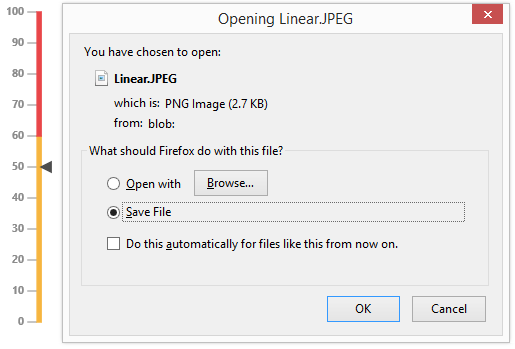

# Exporting

**Linear Gauge** has an exporting feature that converts **Gauge** control into image format and then export in client side. The method API `exportImage` is used to export the **LinearGauge**. It has two arguments such as **file name** and **file format** to specify the file name and file formats. For exporting refer the following code example.



<button id="btnSubmit">Export</button>

FileName 

FileFormat 

<select id="fileFormat">
    <option value="JPEG">JPEG</option>
    <option value="PNG">PNG</option>
</select>





/// <reference path="../tsfiles/jquery.d.ts"></reference>
/// <reference path="../tsfiles/ej.web.all.d.ts"></reference>

module LinearGaugeComponent {

$(function () {
        // declaration
        var basicButton = new ej.Button($("#btnSubmit"), {
            width: "50px", click: "buttonClickEvent", 
        });
        var basicButton = new ej.DopDownList($("#fileFormat"), {
            selectedItemIndex: 0, width: "115" 
        });
        //For rendering linear gauge
       var sample = new ej.datavisualization.LinearGauge($("#LinearGauge1"),{
            labelColor: "#8c8c8c", width: 450, load: "loadGaugeTheme",
            //Adding scale collection
            scales: [{
                width: 4, border: { color: "transparent", width: 0 }, showBarPointers: false, showRanges: true, length: 310,
                position: { x: 52, y: 50 }, markerPointers: [{
                    value: 50, length: 10, width: 10, backgroundColor: "#4D4D4D", border: { color: "#4D4D4D" }
                }],
                //Adding label collection
                labels: [{ font: { size: "11px", fontFamily: "Segoe UI", fontStyle: "bold" }, distanceFromScale: { x: -13 } }],
                //Adding tick collection
                ticks: [{ type: "majorinterval", width: 1, color: "#8c8c8c" }],
                //Adding range collection
                ranges: [{
                    endValue: 60,
                    startValue: 0,
                    backgroundColor: "#F6B53F",
                    border: { color: "#F6B53F" }, startWidth: 4, endWidth: 4
                }, {
                    endValue: 100,
                    startValue: 60,
                    backgroundColor: "#E94649",
                    border: { color: "#E94649" }, startWidth: 4, endWidth: 4
                }]
            }]
        });
    });
}
    function buttonClickEvent() {
        var FileName = $("#fileName").val();
        var FileFormat = new ej.DopDownList($("#fileFormat"));
        FileFormat.option(value);        
        var linearGaugeSample = new ej.datavisualization.LinearGauge($("#lineargauge"));
         linearGaugeSample.exportImage(FileName,FileFormat);
    }
    $("#sampleProperties").ejPropertiesPanel();



Execute the above code to render the following output.

