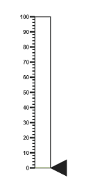
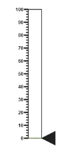
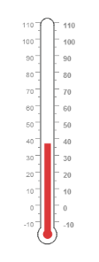

# Getting Started

This section briefly explains on how to create a Linear Gauge control for your application.

* You can provide data for a Linear Gauge and display them in a required way. You can also customize the default Linear Gauge appearance to meet your requirements.
* In this example, you will learn how to create a Linear Gauge and how to design a thermometer, which can be used to check the body temperature of a person.

## Create a Linear Gauge

You can easily create the Digital Gauge widget by using the following steps.

1.First create an TypeScript Project and add the following  references in the app.ts 

For common getting started of TypeScript , you can refer [here](https://help.syncfusion.com/js/typescript).

The default type definition file **ej.web.all.d.ts** needs to include the support for type-checking while initializing any of the Syncfusion widgets. 

The important step you need to do is to copy the ej.web.all.d.ts file into your project and then need to refer it in your TypeScript application (app.ts file), so that you will get the intelliSense support and also the compile time type-checking.

You can find the ej.web.all.d.ts file in the following location,

(installed location)\Syncfusion\Essential Studio\{{ site.releaseversion }}\JavaScript\assets\typescript

Apart from ej.web.all.d.ts file, it is also necessary to make use of the **jquery.d.ts** file in your TypeScript application, which can be downloaded from [here](https://github.com/DefinitelyTyped/DefinitelyTyped).

2.Add the below script reference in the HTML  page 



<!DOCTYPE html>
<html>
<head>
        <link href="http://cdn.syncfusion.com/{{ site.releaseversion }}/js/web/bootstrap-theme/ej.web.all.min.css" rel="stylesheet" />
        
        
         
</head>
<body>
</body>
</html>



In the above code, `ej.web.all.min.js` script reference has been added for demonstration purpose. It is not recommended to use this for deployment purpose, as its file size is larger since it contains all the widgets. Instead, you can use [CSG](http://csg.syncfusion.com/# "") utility to generate a custom script file with the required widgets for deployment purpose.

3.Create a 
 tag.
	
   

<html> <body> 

 </body> </html>


   
4.Initialize the LinearGauge in ts file by using the `ej.LinearGauge` method. 



/// <reference path="tsfiles/jquery.d.ts" />
/// <reference path="tsfiles/ej.web.all.d.ts" />
module LinearGaugeComponent {
    $(function () {
        var linearGaugeSample = new ej.datavisualization.LinearGauge($("#LinearGauge"));
    });
}



Run the above code example to get a default Linear Gauge with default values as follows.

## Set Height and Width values

Basic attributes of each canvas elements are height and width. You can set the height and width of the gauge using the following code example. It sets the height and width of the canvas image where the thermometer is to be rendered.



   
    $(function () {
        var linearGaugeSample = new ej.datavisualization.LinearGauge($("#LinearGauge"),{
                       height: 550,
                       width: 500, 
            
        });
    });



Run the above code example and you will get the following gauge as similar to default. Here height and width of the canvas are set for given values.

## Set Animation option and Label Color

* You can draw the Thermometer with some Label color to display the measurement value. For example give the labelColor as “#8c8c8c”.
* Set the EnableAnimation property as false to avoid animation on the pointers.



    $(function () {
        var linearGaugeSample = new ej.datavisualization.LinearGauge($("#LinearGauge"),{
                              height: 550,
                              width: 500,
                              labelColor: "#8c8c8c",
                              enableAnimation: false, 
            
        });
    });



Run the above code example and you will get the following gauge as the output.

## Provide Scale Values

* The scale must have the appearance of a thermometer. By giving ScaleType as Thermometer, you can render a thermometer design.
* Minimum temperature can go up to -10 and maximum temperature can rise up to 110, so you can give minimum scale value as -10 and maximum value as 110.
* Set the location values such as vertical and horizontal position of the thermometer and give the thermometer height as Length.
* You can give the Minor Interval value as 5 to get the exact temperature on the patient.



     $(function () {
        var linearGaugeSample = new ej.datavisualization.LinearGauge($("#LinearGauge"),{
                            height: 550,
            width: 500,
            labelColor: "#8c8c8c",
            enableAnimation: false,
            scales: [{
                type: "thermometer",
                backgroundColor: "transparent",
                minimum: -10,
                maximum: 110,
                minorIntervalValue: 5,
                width: 20,
                position: { x: 50, y: 18 },
                length: 355,
                border: { width: 0.5 }
                }]
            
        });
    });
    


Run the above code example and you will get the following gauge as the output.

## Add Pointers

In Linear Gauge the two types of pointers available are: Marker pointer and Bar pointer.

* Marker pointer is displayed as a pointer device that shows the actual values. But for your thermometer there is no need for the marker pointer. So you can hide the marker pointer by giving opacity as 0. 
* Bar pointer acts as the mercury metal that shows the exact temperature of the patient. Set some of the basic properties of the Bar pointer such as Width, BarPointerDistanceFromScale, BarPointerValue and BarPointerBackgroundColor.



 $(function () {
     
        var linearGaugeSample = new ej.datavisualization.LinearGauge($("#LinearGauge"),{
                            height: 550,
            width: 500,
            labelColor: "#8c8c8c",
            enableAnimation: false,
            scales: [{
                //Add the pointers customization code here
                markerPointers: [{ opacity: 0 }],
                barPointers: [{
                    width: 10,
                    distanceFromScale: -0.5,
                    value: 37,
                    backgroundColor: "#DB3738"
                }],
            
        });
    });
    



On executing the above code sample renders a Linear Gauge with bar marker as follows.

##Add Label Customization

* For thermometer, you can display the label value on two sides, to get temperature in different scales. For that you can add two label values in an array.
* To display the value around the scales, labels are used. You can customize the label placement, font (including its style and family) and its distance from scale.



$(function () {
     
        var linearGaugeSample = new ej.datavisualization.LinearGauge($("#LinearGauge"),{
            height: 550,
            width: 500,
            labelColor: "#8c8c8c",
            enableAnimation: false,
            scales: [{
                  labels: [{
                    placement: "near",
                    font: {
                        size: "10px", fontFamily: "Segoe UI",
                        fontStyle: "Normal"
                    }
                },
                {
                    placement: "far",
                    distanceFromScale: { x: 10 }
                }],
               
            }]
            
        });
    });



On executing the above code sample renders a customized Linear Gauge as follows.

## Add Tick Details

* Tick style has two values called major interval and minor interval. You can set major ticks width and height greater than Minor ticks. And you can give TickColor, for better visibility in light backgrounds.
* Here four tick details are used for both sides having minor and major ticks. To display the tick value add the following code example.


$(function () {
     
        var linearGaugeSample = new ej.datavisualization.LinearGauge($("#LinearGauge"),{
           height: 550,
            width: 500,
            labelColor: "#8c8c8c",
            enableAnimation: false,
            scales: [{
                   ticks: [{
                    type: "majorInterval",
                    height: 8,
                    width: 1,
                    color: "#8c8c8c",
                    distanceFromScale: { y: -4 }
                }, {
                    type: "minorInterval",
                    height: 4,
                    width: 1,
                    color: "#8c8c8c",
                    distanceFromScale: { y: -4 }
                }, {
                    type: "majorInterval",
                    placement: "far",
                    height: 8,
                    width: 1,
                    color: "#8c8c8c",
                    distanceFromScale: { y: -4 }
                }, {
                    type: "minorInterval",
                    placement: "far",
                    height: 4,
                    width: 1,
                    color: "#8c8c8c",
                    distanceFromScale: { y: -4 }
                }],
               
            }]
            
        });
    });
    



On executing the above code sample renders a Linear Gauge with custom labels as follows.

## Add Custom Label Details

* Custom labels are used to specify the texts in the gauge.
* It can be customized through various properties.
* In order to show the custom labels, change the showIndicators property to true.
* Here you can use custom text to display three range descriptions.



$(function () {
     
        var linearGaugeSample = new ej.datavisualization.LinearGauge($("#LinearGauge"),{
            height: 550,
            width: 500,
            labelColor: "#8c8c8c",
            enableAnimation: false,
            scales: [{
                showCustomLabels: true,
                 customLabels: [{
                    value: "(° C)",
                    position: { x: 44, y: 78 },
                    font: "Bold 12px Segoe UI", color: "#666666"
                }, {
                    value: "(° F)",
                    position: { x: 56, y: 78 },
                    font: "Bold 12px Segoe UI", color: "#666666"
                },
                {
                    position: { x: 51, y: 90 },
                    font: "Bold 13px Segoe UI",
                    color: "#666666"
                }]
            }]
            
        });
    });



Run the above code example to get the following gauge as output.

## Change Scale from Degree to Fahrenheit 

Add the function that converts the temperature in degree to Fahrenheit in the label, with an index value of 1.



$(function () {
     
        var linearGaugeSample = new ej.datavisualization.LinearGauge($("#LinearGauge"),{
             height: 550,
            width: 500,
            labelColor: "#8c8c8c",
            enableAnimation: false,
            drawLabels:  function () {
                var args = $("#LinearGauge").data("ejLinearGauge");
                if (args.label.index == 1) {
                    args.style.textValue = (args.label.value * (9 / 5)) + 32;
                    args.style.font = "Normal 10px Segoe UI";
                }
            }
        });
    });

    


Run the above code example and you will get the following gauge as output.

## Add Custom Label for Current Value

Add the function that displays the current temperature value in the custom label.



$(function () {
     
        var linearGaugeSample = new ej.datavisualization.LinearGauge($("#LinearGauge"),{
             height: 550,
            width: 500,
            labelColor: "#8c8c8c",
            enableAnimation: false,
            drawLabels:  function () {
                var args = $("#LinearGauge").data("ejLinearGauge");
                if (args.label.index == 1) {
                    args.style.textValue = (args.label.value * (9 / 5)) + 32;
                    args.style.font = "Normal 10px Segoe UI";
                }
            },
       drawCustomLabels : function () {
            var args = $("#LinearGauge").data("ejLinearGauge");
            if (args.customLabelIndex == 2) {

            var temp = args.scaleElement.barPointers[0].value;

            var faValue = (temp * (9 / 5)) + 32;

            if (temp == -10) {

                args.style.textValue = "Very Cold Weather" + "(" + faValue.toFixed(1) + "° F)";

            }

            else if ((temp > -10 && temp < 0) || (temp > 0 && temp < 15)) {

                args.style.textValue = "Cool Weather" + " (" + faValue.toFixed(1) + "° F)";

            }

            else if (temp == 0) {

                args.style.textValue = "Freezing point of Water" + " (" + faValue.toFixed(1) + "° F)";

            }

            else if (temp >= 15 && temp < 30) {

                args.style.textValue = "Room Temperature" + " (" + faValue.toFixed(1) + "° F)";

            }

            else if (temp == 30) {

                args.style.textValue = "Beach Weather" + " (" + faValue.toFixed(1) + "° F)";

            }

            else if (temp == 37) {

                args.style.textValue = "Body Temperature" + " (" + faValue.toFixed(1) + "° F)";

            }

            else if (temp == 40) {

                args.style.textValue = "Hot Bath Temperature" + " (" + faValue.toFixed(1) + "° F)";

            }

            else if (temp > 40 && temp < 100) {

                args.style.textValue = "Very Hot Temperature" + " (" + faValue.toFixed(1) + "° F)";

            }

            else if (temp == 100) {

                args.style.textValue = "Boiling point of Water" + " (" + faValue.toFixed(1) + "° F)";

            }

        }

    }
    });
    });



