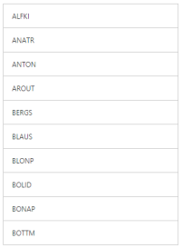
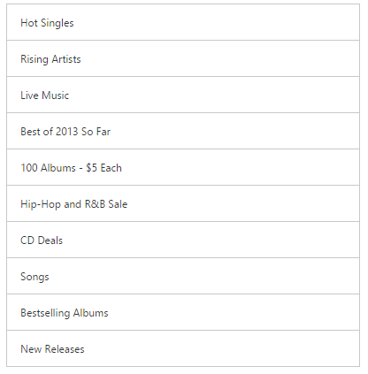
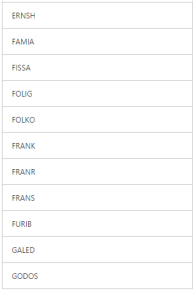

# Data Binding

## Local Data Binding

**Essential Studio Web JS ListView** provides support for **Data Binding**. **Data Binding** provides a simple and consistent way for applications to present and interact with data. Elements can be bounded to data from a variety of data sources. In local data binding, the data source is written inside the program. Then it is handled by the **ListView** control. **DataSource** is used to get the **data source** that holds the list items.

Create div element to render the ListView sample.



    

    


Add the following script in your code.
    


        window.dbitem =
            [
                 { "text": "Hot Singles" },
                 { "text": "Rising Artists" },
                 { "text": "Live Music" },
                 { "text": "Best of 2013 So Far" },
                 { "text": "100 Albums - $5 Each" },
                 { "text": "Hip-Hop and R&B Sale" },
                 { "text": "CD Deals" },
                 { "text": "Songs" },
                 { "text": "Bestselling Albums" },
                 { "text": "New Releases" },
                 { "text": "Bestselling Songs" },
                 { "text": "Rock" },
                 { "text": "Gospel" },
                 { "text": "Latin Music" },
                 { "text": "Jazz" },
                 { "text": "Music Trade-In" },
                 { "text": "Redeem a Gift Card" },
                 { "text": "Band T-Shirts" },
                 { "text": "Web MVC" }];
                 
    $(function () {
        var sample = new ej.ListView($("#listview”), {
                dataSource:window.dbitem,
                 width:400
            });
        });



Run the code to get the following output

 

##  Remote Data Binding

**Essential Studio Web JS ListView** provides support for **Data Binding**.

### OData

OData is a standardized protocol for creating and consuming the data. You can retrieve data from [OData service](http://www.odata.org/) by using **ej.DataManager**.
Here the **CustomerID** field is mapped with text property of the field object. The queries can be created using **ej.Query()**.







  var dataManger = ej.DataManager({ url: "http://js.syncfusion.com/ejservices/Wcf/Northwind.svc/", crossDomain: true
        });   
        var query = ej.Query().from('Customers').take(10);

    $(function () {
        var sample = new ej.ListView($("#listview”"), {
                datasource: dataManger,
                fieldsettings: { "text": "CustomerID" },
                query: query
            
            });
        });



Run the code to get the following output

### URL Adaptor

URL Adaptor of **DataManager** can be used when you are required to use remote service to retrieve data. It interacts with server-side for all **DataManager** Queries and **CRUD** operations.
Now, in the following code example the data is retrieved from **MVC Controller**.







   var dataManager = ej.DataManager({ url: "Home/Data", adaptor: new ej.UrlAdaptor() });
        var query = ej.Query().take(10);

    $(function () {
        var sample = new ej.ListView($("#listview"), {
                datasource: dataManager,
                fieldsettings: { "text": "caption" },
                query: query
            
            });
        });





public partial class ListviewController : Controller
    {

        public JsonResult DataSource()
        {

            IEnumerable Data = setListSource();
            return Json(Data, JsonRequestBehavior.AllowGet);
        }

        public static List<ListLocalData> setListSource()
        {
            List<ListLocalData> listSource = new List<ListLocalData>();

            listSource.Add(new ListLocalData { caption = "Hot Singles" });

            listSource.Add(new ListLocalData { caption = "Rising Artists" });

            listSource.Add(new ListLocalData { caption = "Live Music" });

            listSource.Add(new ListLocalData { caption = "Best of 2013 So Far" });

            listSource.Add(new ListLocalData { caption = "100 Albums - $5 Each" });

            listSource.Add(new ListLocalData { caption = "Hip-Hop and R&B Sale" });

            listSource.Add(new ListLocalData { caption = "CD Deals" });

            listSource.Add(new ListLocalData { caption = "Songs" });

            listSource.Add(new ListLocalData { caption = "Bestselling Albums" });

            listSource.Add(new ListLocalData { caption = "New Releases" });

            return listSource;

        }



Run the code to get the following output

### WebAPI

WebApi Adaptor, extended from ODataAdaptor, of DataManager is used for retrieving data from WebApi service.ASP.NET Web API is a Framework for building HTTP services. You can retrieve data from ASP.NET Web API by using **ej.DataManager**.







      



Run the code to get the following output

## FieldSettings

The **data-ej-FieldSettings** attribute is used to map the **DataSource** field with the list item fields. In addition to the list [item specific properties](/js/listview/grouped-list), the following fields are available while mapping.

_FieldSettings_

<table>
<tr>
<td>
<b>Properties</b></td><td>
<b>Definition</b></td></tr>
<tr>
<td>
ParentPrimaryKey</td><td>
In DB, you can relate any child item to some other item. Set here is ‘<b>PrimaryKey’</b> for the parent item. Here ‘<b>ParentPrimaryKey’</b> defines the ‘<b>PrimaryKey’</b> of some parent item to identify its parent.</td></tr>
<tr>
<td>
Attributes</td><td>
In DB, you can define your desired class name or styles for the list item through the ‘<b>Attributes’</b> field.</td></tr>
</table>

Please refer the following code examples.



    

 

  


Add the following script in your code.
    

 
        window.dbitem =
            [{ "Texts": "Discover Music", "PrimaryKeys": "1", "Title": "Discover Music", "BackIconText": "back" },
                 { "Texts": "Hot Singles", "ParentPrimaryKeyss": "1" },
                 { "Texts": "Rising Artists", "PrimaryKeyss": null, "ParentPrimaryKeyss": "1" },
                 { "Texts": "Live Music", "ParentPrimaryKeyss": "1" },
                 { "Texts": "Best of 2013 So Far", "ParentPrimaryKeyss": "1" },
            { "Texts": "Sales and Events", "PrimaryKeys": "2", "Title": "Sales and Events", "BackIconText": "back" },
                 { "Texts": "100 Albums - $5 Each", "ParentPrimaryKeyss": "2" },
                 { "Texts": "Hip-Hop and R&B Sale", "ParentPrimaryKeyss": "2" },
                 { "Texts": "CD Deals", "ParentPrimaryKeyss": "2" },
            { "Texts": "Categories", "PrimaryKeys": "3", "Title": "Categories", "BackIconText": "back" },
                 { "Texts": "Songs", "ParentPrimaryKeyss": "3" },
                 { "Texts": "Bestselling Albums", "ParentPrimaryKeyss": "3" },
                 { "Texts": "New Releases", "ParentPrimaryKeyss": "3" },
                 { "Texts": "Bestselling Songs", "ParentPrimaryKeyss": "3" },
            { "Texts": "MP3 Albums", "PrimaryKeys": "4", "Title": "MP3 Albums", "BackIconText": "back" },
                 { "Texts": "Rock", "ParentPrimaryKeyss": "4" },
                 { "Texts": "Gospel", "ParentPrimaryKeyss": "4" },
                 { "Texts": "Latin Music", "ParentPrimaryKeyss": "4" },
                 { "Texts": "Jazz", "ParentPrimaryKeyss": "4" },
            { "Texts": "More in Music", "PrimaryKeys": "5", "Title": "More in Music", "BackIconText": "back" },
                 { "Texts": "Music Trade-In", "ParentPrimaryKeyss": "5" },
                 { "Texts": "Redeem a Gift Card", "ParentPrimaryKeyss": "5" },
                 { "Texts": "Band T-Shirts", "ParentPrimaryKeyss": "5" },
                 { "Texts": "Web MVC", "ParentPrimaryKeyss": "5" }];
        window.musicFields = {
            "text": "Texts",
            "primaryKey": "PrimaryKeys",
            "parentPrimaryKey": "ParentPrimaryKeyss",
            "childHeaderTitle": "Title",
            "childHeaderBackButtonText": "BackIconText"
        };
        
    $(function () {
        var sample = new ej.ListView($("#defaultlistbox"), {
                 fieldSettings: window.musicFields, 
                 dataSource:window.dbitem, 
                 width: 400,
                 showHeader:true,
                 headerTitle:"ListView"
                  });
        });



Run the code to get the following output

 

When you click on the parent item, it navigates to its corresponding child list item as follows.

 

