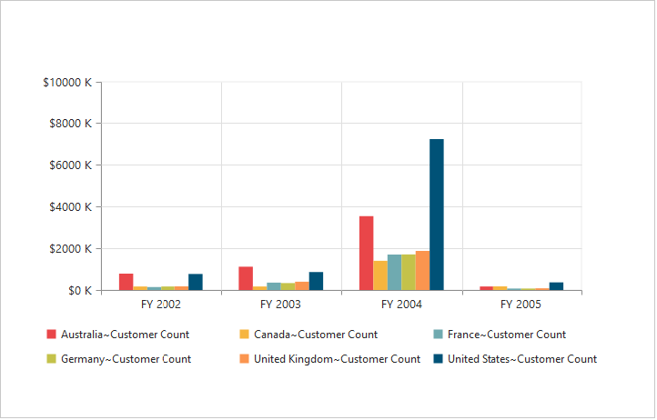

# Axes 

## Label format

### Format numeric labels
By using the `labelFormat` property, you can format the numeric labels. Numeric values can be formatted with n (number with decimal points), c (currency), and p (percentage) commands.



/// <reference path="jquery.d.ts" />
/// <reference path="ej.web.all.d.ts" />

$(function () {
    var sample = new ej.PivotChart($("#PivotChart1"), { 
		primaryYAxis: {
		 	labelFormat: "c" 
		 },
	});
});



Following table describes the result when applying some commonly used label formats on numeric values:

<table>
<tr>
<th>
Label Value</th><th>
Label Format Property Value</th><th>
Result</th><th>
Description</th>
</tr>
<tr><td>
1000</td><td>
n1</td><td>    
1000.0</td><td>
The Number is rounded to 1 decimal place</td>
</tr>
<tr><td>
1000</td><td>
n2</td><td>    
1000.00</td><td>
The Number is rounded to 2 decimal place</td>
</tr>
<tr><td>
1000</td><td>
n3</td><td>    
1000.000</td><td>
The Number is rounded to 3 decimal place</td>
</tr>
<tr><td>
0.01</td><td>
p1</td><td>    
1.0%</td><td>
The Number is converted to percentage with 1 decimal place</td>
</tr>
<tr><td>
0.01</td><td>
p2</td><td>    
1.00%</td><td>
The Number is converted to percentage with 2 decimal place</td>
</tr>
<tr><td>
0.01</td><td>
p3</td><td>    
1.000%</td><td>
The Number is converted to percentage with 3 decimal place</td>
</tr>
<tr><td>
1000</td><td>
c1</td><td>    
$1,000.0</td><td>
The Currency symbol is appended to number and number is rounded to 1 decimal place</td>
</tr>
<tr><td>
1000</td><td>
c2</td><td>    
$1,000.00</td><td>
The Currency symbol is appended to number and number is rounded to 2 decimal place</td>
</tr>
</table>

### Label format customization
By using the `labelFormat` property of `primaryYAxis`, you can add the category labels with prefix and/or suffix.



/// <reference path="jquery.d.ts" />
/// <reference path="ej.web.all.d.ts" />

$(function () {
    var sample = new ej.PivotChart($("#PivotChart1"), { 
		primaryYAxis: {
		 	labelFormat: "${value}K" 
		 },
	});
});



## Common axis features

### Axis visibility
Axis visibility can be set by using the `visible` property of the respective axis.

N> By default, the value of `visible` property is true in the pivot chart.



/// <reference path="jquery.d.ts" />
/// <reference path="ej.web.all.d.ts" />

$(function () {
    var sample = new ej.PivotChart($("#PivotChart1"), { 
		primaryYAxis: {
		 	visible: false
		 },
	});
});



### Label customization
By using the `font` property of the axis, you can customize the font family, color, opacity, size, and font-weight of labels.



/// <reference path="jquery.d.ts" />
/// <reference path="ej.web.all.d.ts" />

$(function () {
    var sample = new ej.PivotChart($("#PivotChart1"), { 
		primaryXAxis: {
            font: {
                size: "20px",
                color: "blue",
                fontWeight: "bold",
                fontFamily:"Segoe UI"
            }
        },
	});
});



### Label and tick positioning
Axis labels and ticks can be positioned inside or outside the chart area by using the `axisLabelPosition` and `tickLinesPosition` properties. The labels and ticks are positioned outside the chart area, by default.



/// <reference path="jquery.d.ts" />
/// <reference path="ej.web.all.d.ts" />

$(function () {
    var sample = new ej.PivotChart($("#PivotChart1"), { 
		primaryXAxis: {
            axislabelPosition: "inside",
            tickLinesPosition: "inside",
        },
	});
});



### Grid lines customization
By using the `majorGridLines` and `minorGridLines` properties of the axis, you can customize the width, color, visibility, and opacity of the grid lines.

N> By default, the minor grid lines are not visible in the pivot chart.



/// <reference path="jquery.d.ts" />
/// <reference path="ej.web.all.d.ts" />

$(function () {
    var sample = new ej.PivotChart($("#PivotChart1"), { 
		primaryXAxis: {
            majorGridLines: {
                width: 5,
                color: 'blue',
                visible:true
            },
            minorGridLines: {
                width: 25,
                color: 'red',
                visible: true
            },
            minorTicksPerInterval: 1
        },
	});
});



### Tick line customization
By using the `majorTickLines` and `minorTickLines` properties of the axis, you can customize the width, color, visibility, size, and opacity of the tick lines.

N> By default, the minor tick lines are not visible in the pivot chart.



/// <reference path="jquery.d.ts" />
/// <reference path="ej.web.all.d.ts" />

$(function () {
    var sample = new ej.PivotChart($("#PivotChart1"), { 
		primaryXAxis: {
            majorTickLines: {
                width: 10,
                size: 15,
                color: 'blue',
                visible:true
            },
            minorTickLines: {
                width: 15,
                size: 25,
                color: 'red',
                visible: true
            },
            minorTicksPerInterval: 1
        },
	});
});



### Inversing axis
The axis can be inversed by using the `isInversed` property of the axis.

N> By default, the `isInversed` property is false in the pivot chart.



/// <reference path="jquery.d.ts" />
/// <reference path="ej.web.all.d.ts" />

$(function () {
    var sample = new ej.PivotChart($("#PivotChart1"), { 
		primaryYAxis: {
            isInversed: true
        },
        primaryXAxis: {
            isInversed: true
        },
	});
});



### Placing axes at opposite side
The `opposedPosition` property of chart axis can be used to place the axis at the opposite direction from its default position.

N> By default, the `opposedPosition` property is false in the pivot chart.



/// <reference path="jquery.d.ts" />
/// <reference path="ej.web.all.d.ts" />

$(function () {
    var sample = new ej.PivotChart($("#PivotChart1"), { 
		primaryYAxis: {
            opposedPosition: true
        },
        primaryXAxis: {
            opposedPosition: true
        },
	});
});



