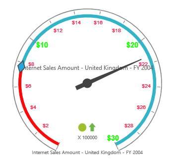

# Labels

## Adding label collection

Label collection can be directly added to the scales option within the pivot gauge control.



/// <reference path="jquery.d.ts" />
/// <reference path="ej.web.all.d.ts" />

$(function () {
    var sample = new ej.PivotGauge($("#PivotGauge1"), { 
        labels: [{
                angle: 20
            }],
    });
});	



## Appearance customization

The appearance of the label can be customized through the following properties:

* **angle**: Displays labels in a rotated manner. By default, the value is 0.
* **color**: Displays the label in a specified color.
* **opacity**: Sets the opacity of the label. By default, the value is 1.
* **type**: Indicates the label for major intervals or minor intervals. By default, it takes major intervals.
* **includeFirstValue**: Includes the initial value based on user requirement.  By default, the value is true.
* **font**: Sets the font size, font style, and font family of the label.



/// <reference path="jquery.d.ts" />
/// <reference path="ej.web.all.d.ts" />

$(function () {
    var sample = new ej.PivotGauge($("#PivotGauge1"), { 
        labels: [{
                color: "#1AFF01",
                opacity: 80,
                includeFirstValue: false,
                font: {
                    size: "15px",
                    fontFamily: "Arial",
                    fontStyle: "Bold"
                },
                type: "major"
            },
                {
                    color: "#FF103F",
                    opacity: 80,
                    includeFirstValue: true,
                    font: {
                        size: "10px",
                        fontFamily: "Arial",
                        fontStyle: "Normal"
                    },
                    type: "minor"
                }
            ],
    });
});	



 

## Unit text

The `unitText` property is used to add some text along with labels. Normally,   the unit/measurement of the numeric value is indicated through the unit text. By using the `unitTextPosition` property, the text can be positioned in front or back.

N> By default, text appears at the back.



/// <reference path="jquery.d.ts" />
/// <reference path="ej.web.all.d.ts" />

$(function () {
    var sample = new ej.PivotGauge($("#PivotGauge1"), { 
        labels: [{
                type: "major",
                unitText: "$",
                unitTextPosition: "front"
            },
                {
                    type: "minor",
                    unitText: "$",
                    unitTextPosition: "front"
                }
            ],
    });
});	



 

