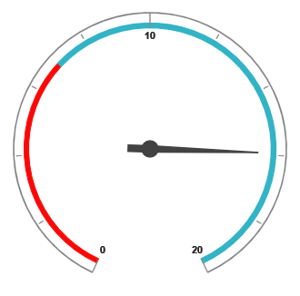

# Scale

## Adding Scale

Scale can be added within the PivotGauge control. 



/// <reference path="jquery.d.ts" />
/// <reference path="ej.web.all.d.ts" />

$(function () {
    var sample = new ej.PivotGauge($("#PivotGauge1"), {
        scales: [{
            radius: 150, 
            showScaleBar: true
        }]
    });
});	



 

## Scale Customization

### Pointer Cap
Pointer Cap is a circular shape element which is located at the center of the PivotGauge. It can be customized with the property `pointerCap` inside the scales option. Following are the properties used to customize its appearance.

* **radius** – sets the radius of the pointer cap.
* **borderColor** – sets the color of the pointer cap border.
* **borderWidth** – sets the width of the pointer cap border.
* **backgroundColor** – sets the background color of the pointer cap.



/// <reference path="jquery.d.ts" />
/// <reference path="ej.web.all.d.ts" />

$(function () {
    var sample = new ej.PivotGauge($("#PivotGauge1"), {
        scales: [{
            radius: 150, 
            showScaleBar: true,
            pointerCap: {
                radius: 5,
                borderWidth: 2,
                borderColor: "green",
                backgroundColor: "yellow"
            }
        }]
    });
});	



 

### Appearance
The appearance of the scale can be customized through the following properties.

* **radius** – sets the radius of the scale.
* **backgroundColor** – sets the background color of the scale.
* **border** – sets the border of the scale with color and width properties.
* **size** – sets the size of the scale.
* **minimum** – sets the least value of the scale.
* **maximum** – sets the highest value of the scale.
* **majorIntervalValue** – sets the interval between minor ticks in the scale.
* **minorIntervalValue** – sets the interval between major ticks in the scale.
* **direction** – sets the direction of the scale.  By default it takes “Clockwise” direction.

The `showIndicators`, `showTicks`, `showRanges`, `showPointers`, and `showScaleBar` properties are used to enable/disable the indicators, ticks, ranges, pointers and scale bar respectively.  By default, `showTicks` and `showPointers` are set to true, and other properties are set as false.



/// <reference path="jquery.d.ts" />
/// <reference path="ej.web.all.d.ts" />

$(function () {
    var sample = new ej.PivotGauge($("#PivotGauge1"), {
        scales: [{
                radius: 120, showScaleBar: true,
                size: 10,
                backgroundColor: "yellow",
                border: {
                    width: 3,
                    color: "blue"
                },
                minimum: 20,
                maximum: 120,
                majorIntervalValue: 20,
                minorIntervalValue: 5,
                direction: "counterClockwise"
        }]
    });
});	



 