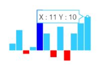
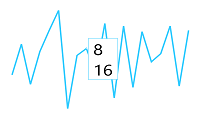

## Tooltip  

A `tooltip` follows the pointer movement and is used to indicate the value of a point. This feature is applicable for line, column, pie, and area Sparkline. You can enable the tooltip by setting it's `visible` property as **true**.



/// <reference path="tsfiles/jquery.d.ts" />
/// <reference path="tsfiles/ej.web.all.d.ts" />

module SparklineComponent {
    $(function () {
        var sparklinesample = new ej.datavisualization.Sparkline($("#Sparkline"),{
         // ...
            tooltip: {
                visible: true,
            },
            // ...
       });
    });
}



## Tooltip Customization

You can customize the tooltip `fill color`, `border`,`border` properties `border color`, `border width`and `font` properties `color`, `font family`, `font style`, `font weight`, `opacity`, `size`



$(function () {
        var sparklinesample = new ej.datavisualization.Sparkline($("#Sparkline"),{
            // ...
            tooltip: {
                fill: 'red',
                border: {
                    color: "green",
                    width: 3
                },
                font: {
                    size: "12px",
                    fontFamily : "Algerian",
                    fontStyle : "italic",
                    fontWeight : "lighter",
                    opacity : 0.5,
                }
            },
            // ...
       });
});



## Tooltip Template   

HTML elements can be displayed in the tooltip by using the `template` option of the tooltip. The template option takes the value of the id attribute of the HTML element. You can use the **#point.x#** and **#point.y#** as place holders in the HTML element to display the x and y values of the corresponding point.



    

        
#point.x#

        
#point.y#

    

$(function () {
        var sparklinesample = new ej.datavisualization.Sparkline($("#Sparkline"),{
            // ...
            tooltip: {
                visible: true,
                template: "item",
            },
            // ...
      });
});



