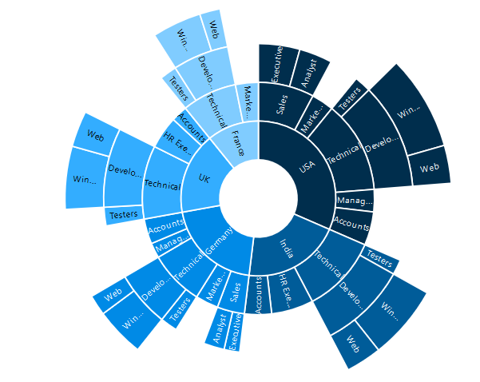

# Appearance
The appearance of the Sunburst Chart can be customized as shown below 

## Palette
The Sunburst Chart displays different segments in different colors by default. You can customize the color of each segment by providing a custom color palette of your choice by using the **palette** property.



/// <reference path="tsfiles/jquery.d.ts" />
/// <reference path="tsfiles/ej.web.all.d.ts" />

module  sunburstComponent {
    $(function () {
        var sample = new ej.datavisualization.SunburstChart($("#Sunburst"),{
            // ...
         palette: ["#002e4d", "#005c99", "#008ae6", "#33adff", "#80ccff"],	

            // ...

        });
    });
}



The Sunburst Chart rendered with palette colors

 
## Built- in Themes
The Sunburst Chart supports different themes. 
*	flat light
*	flat dark
*	gradient light
*	gradient dark
*	azure
*	azure dark
*	lime
*	lime dark
*	saffron
*	saffron dark
*	gradient-azure
*	gradient-azuredark
*	gradient-lime
*	gradient-limedark
*	gradient-saffron
*	gradient-saffrondark

You can set your desired theme by using the **theme** property. **Flat light** is the default theme used in the Sunburst Chart.



 $(function () {
        var sample = new ej.datavisualization.SunburstChart($("#Sunburst"),{
            // ...
       theme: "flatdark",		

            // ...

        });
    });



