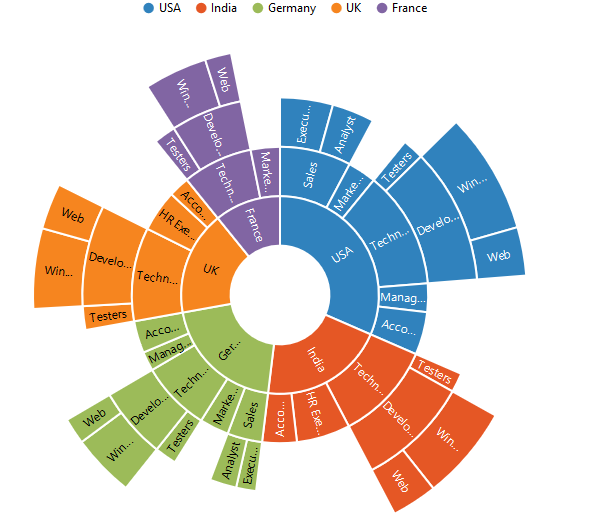
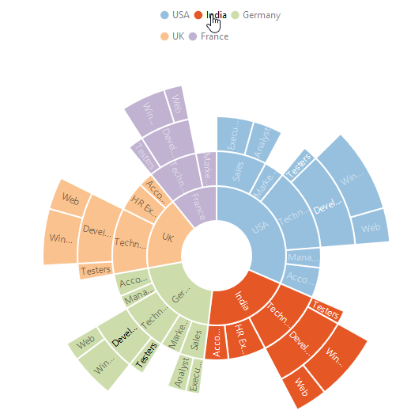

## Legend
The legend is used to represent the first level of items in the Sunburst Chart.The **legend** can be initialized using the below code snippet



/// <reference path="tsfiles/jquery.d.ts" />
/// <reference path="tsfiles/ej.web.all.d.ts" />

module  sunburstComponent {

$(function () {

var sample = new ej.datavisualization.SunburstChart($("#Sunburst"),{
            // ...
        legend: {visible: true},    	
            // ...
        });
    });
}



## Legend Icon 

You can specify different shapes of legend icon by using the **shape** property of the legend. By default, legend shape is **Circle**. The Sunburst chart has some predefined shapes such as:
* Circle
* Cross
* Diamond
* Pentagon
* Rectangle
* Triangle



$(function () {

var sample = new ej.datavisualization.SunburstChart($("#Sunburst"),{
            // ...
        legend: {shape: "pentagon"},    	
            // ...
        });
    });


 
## Positioning the Legend

By using the **position** property, you can position the legend at left, right, top or bottom of the chart. 



$(function () {

var sample = new ej.datavisualization.SunburstChart($("#Sunburst"),{
            // ...
        legend: {position: "top"},    	
            // ...
        });
    });



 
### Customization

## Legend Item Size and border
You can change the size of the legend items by using the **itemStyle.width** and **itemStyle.height** properties. To change the legend item border, use **border** property of the legend .



$(function () {

var sample = new ej.datavisualization.SunburstChart($("#Sunburst"),{
            // ...
        legend: {position:"top",itemStyle:{height:13,width:13},border: { color: "#FF0000", width: 1 }},    	
            // ...
        });
    });



## Legend Size

By default, legend takes 20% of the height horizontally when it was placed on the top or bottom position and 20% of the width vertically while placing on the left or right position of the chart. You can change this default legend size by using the **size** property of the legend.



$(function () {

var sample = new ej.datavisualization.SunburstChart($("#Sunburst"),{
            // ...
         legend: {position:"top",size:{ height:"75",width:"200"}},    	
            // ...
        });
    });



 

## Legend Row and Columns

You can arrange the legend items horizontally and vertically by using the **rowCount** and **columnCount** properties of the legend.
•	When only the rowCount is specified, the legend items are arranged according to the rowCount and number of columns may vary based on the number of legend items.
•	When only the columnCount is specified, the legend items are arranged according to the columnCount and number of rows may vary based on the number of legend items.
•	When both the properties are specified, then the one which has higher value is given preference. For example, when the rowCount is 4 and columnCount is 3, legend items are arranged in 4 rows.
•	When both the properties are specified and have the same value, the preference is given to the columnCount when it is positioned at the top/bottom position. The preference is given to the rowCount when it is positioned at the left/right position.
 


$(function () {

var sample = new ej.datavisualization.SunburstChart($("#Sunburst"),{
            // ...
          legend: {position:"top",rowCount:"2",columnCount:"3"},    	
            // ...
        });
    });



 
## LegendInteractivity

You can select a specific category while clicking on corresponding legend item through **clickAction' property. 

It has three types of action
*	ToggleSegmentSelection
*	ToggleSegmentVisibility
*	None

## ToggleSegmentSelection

Used to highlight specific category while clicking on legend item



$(function () {

var sample = new ej.datavisualization.SunburstChart($("#Sunburst"),{
            // ...
         legend: {clickAction:"toggleSegmentSelection"},   	
            // ...
        });
    });



 
## Toggle Segment Visibility

Used to disable the specific category while clicking on legend item.



$(function () {

var sample = new ej.datavisualization.SunburstChart($("#Sunburst"),{
            // ...
         legend: {clickAction:"toggleSegmentVisibility"},   	
            // ...
        });
    });



