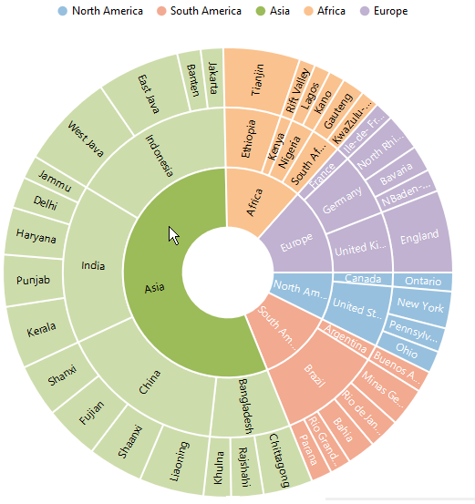

# Selection 
EjSunburstChart provides selection support for the points on mouse click. To enable the selection , set the **enable** property to true in the **selectionSettings**. 



/// <reference path="tsfiles/jquery.d.ts" />
/// <reference path="tsfiles/ej.web.all.d.ts" />

module  sunburstComponent {

$(function () {

var sunburstsample = new ej.datavisualization.SunburstChart($("#Sunburst"),{
          
          //..
           selectionSettings: { enable: true },            
         //..

        });
    });
}



 
## Selection Display mode

 You can customize the selected  segment appearance by using color or opacity. You can choose between color or opacity using the **type** property in the selection Settings.

*	selectionByColor – To display the selected segment appearance using color.
*	selectionByOpacity – To display the selected segment appearance using opacity.



$(function () {

var sunburstsample = new ej.datavisualization.SunburstChart($("#Sunburst"),{
          
          //..
            selectionSettings: { enable: true, type:"color",color:"red" },            
         //..

        });
});      

 

## Selection Mode

Sunburst chart provides multiple options to represent the selected categories. You can select the segment categories by using the **mode** property in selectionSettings
*	Child – To selection the child of selected parent.
*	All – To selection the entire categories in group.
*	Parent – To selection the parent of selected child.
*	Single - To selection single item in the category.

### Child

The following code shows how to set the selection type as child 



$(function () {

var sunburstsample = new ej.datavisualization.SunburstChart($("#Sunburst"),{
          
          //..
             selectionSettings: { enable: true,mode:"child"},               
         //..

        });
}); 



 
### Parent

The parent mode can be enabled by using the below code 



$(function () {

var sunburstsample = new ej.datavisualization.SunburstChart($("#Sunburst"),{
          
          //..
             selectionSettings: { enable: true,mode:"parent"},               
         //..

        });
}); 



 
### Point

To selection the particular segment, the point mode of the selection settings is used.



$(function () {

var sunburstsample = new ej.datavisualization.SunburstChart($("#Sunburst"),{
          
          //..
             selectionSettings: { enable: true,mode:"point"},               
         //..

        });
}); 

 

 
### All

The following code snippet is used for the all mode of selection settings



$(function () {

var sunburstsample = new ej.datavisualization.SunburstChart($("#Sunburst"),{
          
          //..
             selectionSettings: { enable: true,mode:"all"},               
         //..

        });
}); 



