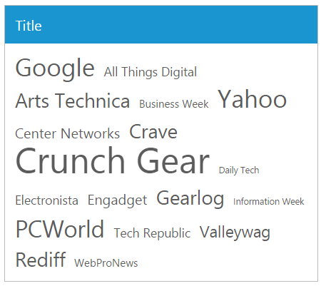

# Data-Binding

To render the **TagCloud** widget, it is necessary to bind the data to it in a proper way. The following sub-properties provides you a way to bind local or remote data to the **TagCloud** widget by binding the appropriate data fields to the corresponding options.

## Fields 

### dataSource 

This property assigns the local **JSON** data or remote (URL binding) data to the **TagCloud** control.

### query 

It accepts the data of object type that is usually the query string to fetch the required data from a specific table based on certain conditions. As this property is optional, when it is not specified, then the entire records that are initially assigned through dataSource is taken into consideration.

### text

It maps the corresponding text field name from the data table or **JSON** data that is assigned to the dataSource with the text property of the **TagCloud** control. The text value that is fetched from the table renders the value to be displayed in the **TagCloud**.

### URL

URL field in the data table or **JSON** data assigned the datasource is mapped to the URL property of the **TagCloud** control. The URL property defines the link to be navigated on clicking the corresponding text item.

### frequency

It maps to the frequency field name from the data table or **JSON** data that is assigned to the dataSource. The frequency value that is fetched from the table should be a number to categorize the font size.

## Local Binding

Local data binding allows you to map **JSON** data to **TagCloud**, that the corresponding text, URL, and frequency fields are assigned with a local **JSON** data.

### Defining the Local data for TagCloud

The following steps explains you the local data binding to **TagCloud** widget,

In the **HTML** page, add a **&lt;div&gt;** element to configure **TagCloud** widget.







/// <reference path="tsfiles/jquery.d.ts" />
/// <reference path="tsfiles/ej.web.all.d.ts" />

module TagCloudComponent {
    
    // Define local data source elements with text, url and frequency fields.

    var websiteCollection = [
        { text: "Google", url: "http://www.google.com", frequency: 12 },
        { text: "All Things Digital", url: "http://allthingsd.com/", frequency: 3 },
        { text: "Arts Technica", url: "http://arstechnica.com/", frequency: 8 },
        { text: "Business Week", url: "http://www.businessweek.com/", frequency: 2 },
        { text: "Yahoo", url: "http://in.yahoo.com/", frequency: 12 },
        { text: "Center Networks",url: "http://www.centernetworks.com/", frequency: 5 },
        { text: "Crave", url: "http://news.cnet.com/crave/", frequency: 8 },
        { text: "Crunch Gear", url: "http://techcrunch.com/gadgets/", frequency: 20 },
        { text: "Daily Tech", url: "http://www.dailytech.com/", frequency: 1 },
        { text: "Electronista", url: "http://www.electronista.com/", frequency: 3 },
        { text: "Engadget", url: "http://www.engadget.com/", frequency: 5 },
        { text: "Gearlog", url: "http://www.gearlog.com/", frequency: 9 },
        { text: "Information Week",url:"http://www.informationweek.com/",frequency: 0 },
        { text: "PCWorld", url: "http://www.pcworld.com/", frequency: 11 },
        { text: "Tech Republic", url: "http://techrepublic.com/", frequency: 3 },
        { text: "Valleywag", url: "http://valleywag.gawker.com/", frequency: 6 },
        { text: "Rediff", url: "http://in.rediff.com/", frequency: 9 },
        { text: "WebProNews", url: "http://www.webpronews.com/", frequency: 2 }
     ];

 
   $(function () {

     var sample = new ej.TagCloud($("#website"), {  
        dataSource: websiteCollection
    });
   });
}



The following screenshot displays the **TagCloud** control with local data binding.

## Remote Binding

**TagCloud** provides remote data binding support to populate **TagCloud** items and the values can be mapped to the **TagCloud** fields from a remote web service by using **DataManager** and **Query**. 

DataManager is used to manage relational data in **JavaScript**. It supports **CRUD** (Create, Read, Update, and Destroy) in individual requests and batch. DataManager use two different classes, ej.DataManager for processing, and ej.Query for serving data. ej.DataManager communicates with data source and ej.Query generates data queries that are read by DataManager.

### Configuring Remote data for TagCloud

The following steps explains you the local data binding to **TagCloud** widget.

In the **HTML** page, add a **&lt;div&gt;** element to configure **TagCloud** widget.



 



Define DataManager and assign remote data source to it. Initialize query for binding data to **TagCloud** text. Here DataManager renders the remote web service and filters the data by using Query. The **select** property of **ejQuery**, is used to retrieve the specified columns from the data source.



    var dataManager = ej.DataManager({
        url: "http://mvc.syncfusion.com/Services/Northwnd.svc/"
    });
    // Query creation
    var query = ej.Query().from("Orders").take(10);



Assign datasource and query property values to bind the remote data. Map the corresponding fields to **TagCloud** control as follows:



 
     var sample = new ej.TagCloud($("#website"), {  
        dataSource: dataManager,
        query: query,
        fields: { text: "CustomerID", frequency: "EmployeeID" }
    });



The following screenshot displays a **TagCloud** control with remote data binding.

 

