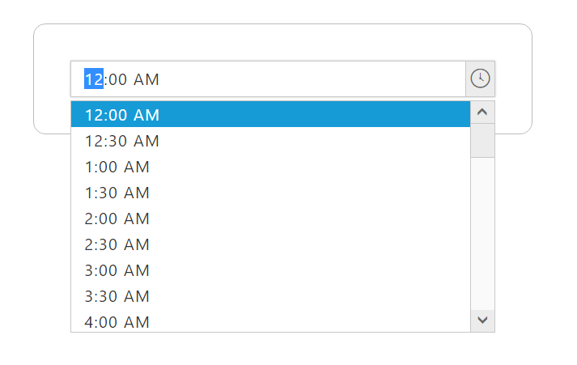

# Getting Started

This section explains you how to render and configure TimePicker component in a TypeScript application.

## Create your first TimePicker	

1. Create a TypeScript application and refer the dependent modules, script and CSS with the help of given Getting started document.

2. In the index.HTML file, add the input element for rendering TimePicker component as given below.



        <input id="timepick" />

 

3. Create a TypeScript file named "app.ts" file and refer the required definition files as given below.



        /// <reference path="tsfiles/jquery.d.ts" />
        /// <reference path="tsfiles/ej.web.all.d.ts" />

 

4. Now, initialize the TimePicker component by using ej.TimePicker method. 



        /// <reference path="tsfiles/jquery.d.ts" />
        /// <reference path="tsfiles/ej.web.all.d.ts" />

        $(function () {
                var sample = new ej.TimePicker($("#datetimepick"));
            });

 

### Run the application

To run the application, navigate the project folder and open command prompt window and execute the following command.



tsc

 

This command compiles the app.ts file to generate a JS file named app.js file. 
Refer the app.js file in index.html and browse the html file to see the following output.

 

### Configuring Properties

## DisableTimeRanges

This property specifies the list of time range to be disabled in TimePicker control. To know more about TimePicker properties please refer the [API reference] (https://help.syncfusion.com/api/js/ejtimepicker) documentation.



        /// <reference path="tsfiles/jquery.d.ts" />
        /// <reference path="tsfiles/ej.web.all.d.ts" />

        module TimePickerComponent {
            $(function () {
                var sample = new ej.TimePicker($("#timepick"), { disableTimeRanges: [{ startTime: "3:00 AM", endTime: "6:00 AM" },
                            { startTime: "1:00 PM", endTime: "3:00 PM" },
                            { startTime: "8:00 PM", endTime: "10:00 PM" }]});
            });
        }



The following screenshot illustrates the output of above code.

 
