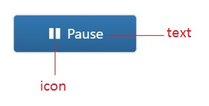

# Getting Started

Using the following steps, you can create a **TypeScript** ToggleButton component.

## Creating an ToggleButton in TypeScript

You can create a **TypeScript** application with the help of the given [TypeScript Getting Started Documentation](https://help.syncfusion.com/js/typescript).

To create a ToggleButton,include a `input` element with the HTML `id` attribute and pre-defined options set to it.



    <input type="checkbox" id="togglebtn">
    <label for="togglebtn">Toggle</label>
    



* Create app.ts file and use the below content



    /// <reference path="jquery.d.ts" />  
    /// <reference path="ej.web.all.d.ts" />

    module ToggleButtonComponent {
        var toggleObj = new ej.ToggleButton($("#togglebtn"), {
            defaultText: "Play",
            activeText: "Pause",
            defaultPrefixIcon: "e-icon e-mediaplay",
            activePrefixIcon: "e-icon e-mediapause",
            showRoundedCorner: true,
            size: "large",
            contentType: "textandimage",
        })
    }
          


* Now build your application, so that the **app.ts** file will compiled and automtically generated the **app.js** file which is added to your project (User have nothing to do with this file). Now, whatever code changes that you make in **app.ts** file will be reflected in app.js file by compiling     build the aplication.

Execution of above code will render the following output.

