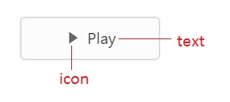

# Getting Started

Using the following steps, you can create a **Typescript** ToggleButton component.

## Creating an ToggleButton in Typescript

You can create a **Typescript** application with the help of the given [Typescript Getting Started Documentation](https://help.syncfusion.com/js/typescript).

 Within an index.html file and add the scripts references in the order mentioned in the following code example.



<!DOCTYPE html>
<html>
<head>
<title>Typescript Application</title>
<link href="http://cdn.syncfusion.com/**{{**site.releaseversion**}}**/js/web/flat-azure/ej.web.all.min.css" rel="stylesheet" />

</head>
<body>
<!--Add ToggleButton sample  here-->
</body>
</html>



This can be created from a `input` element with the HTML `id` attribute and pre-defined options set to it.



<input type="checkbox" id="togglebtn">
<label for="togglebtn">Toggle</label>



* Create app.ts file and use the below content



/// <reference path="jquery.d.ts" />  
/// <reference path="ej.web.all.d.ts" />

module ToggleButtonComponent {
    var toggleObj = new ej.ToggleButton($("#togglebtn"), {
            defaultText: "Play",
            activeText: "Pause",
            defaultPrefixIcon: "e-icon e-mediaplay",
            activePrefixIcon: "e-icon e-mediapause",
            showRoundedCorner: true,
            size: "large",
            contentType: "textandimage",
        })
}



* Now build your application, so that the **app.ts** file will compiled and automtically generated the **app.js** file which is added to your project (User have nothing to do with this file). Now, whatever code changes that you make in **app.ts** file will be reflected in app.js file by compiling     build the aplication.

Execution of above code will render the following output.

