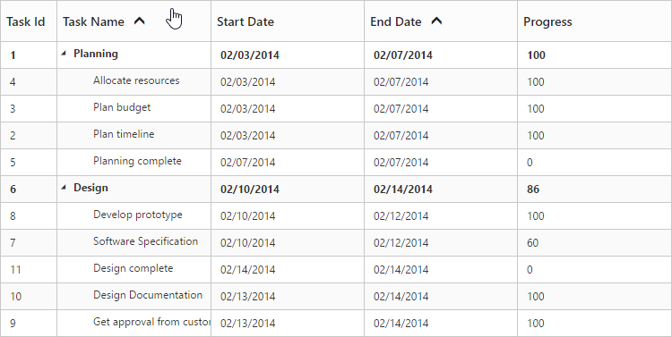
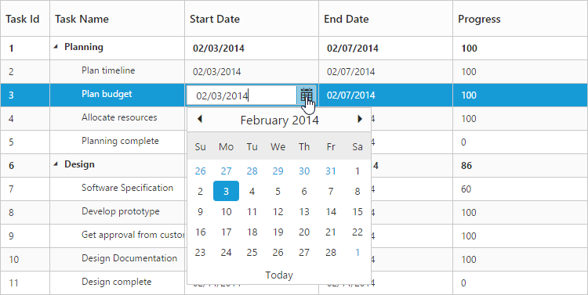

# Getting Started
This section helps to understand the getting started of the TypeScript TreeGrid with the step-by-step instructions.

## Create your first TreeGrid in TypeScript

To get started Syncfusion TypeScript application refer [`this`](https://help.syncfusion.com/reactjs/overview) page for basic control integration and script references.

The **Essential TypeScript TreeGrid** has been designed to represent and edit the hierarchical data. 

This section explains how to create a TreeGrid widget in your application with hierarchical data source and enable sorting and editing. The following screenshot displays the output.

It is necessary to copy the ej.web.all.d.ts file into your project and then need to refer it in your TypeScript application (app.ts file), so that you will get the intelliSense support and also the compile time type-checking.

You can find the ej.web.all.d.ts file in the following location,

(installed location)\Syncfusion\Essential Studio\{{ site.releaseversion }}\JavaScript\assets\typescript

Apart from ej.web.all.d.ts file, it is also necessary to make use of the jquery.d.ts file in your TypeScript application, which can be downloaded from [here](https://github.com/DefinitelyTyped/DefinitelyTyped).

1.Create HTML file and add the following necessary script and css files to the HTML file.



    <!DOCTYPE html>
    <html xmlns="http://www.w3.org/1999/xhtml">
        <head>
            <meta name="viewport"content="width=device-width, initial-scale=1.0"/>
            <meta charset="utf-8" />
            <link href=" http://cdn.syncfusion.com/{{ site.releaseversion }}/js/web/flat-azure/ej.web.all.min.css" rel="stylesheet"/>           
            
            
                    
        </head>
        <body>
        <!--Add TreeGrid control here -->
        </body>
    </html>



2.Add **&lt;div&gt;** element with in the **&lt;Body&gt;** tag.



    



3.Create the TreeGrid with the empty data source.



/// <reference path="../tsfiles/jquery.d.ts" />
/// <reference path="../tsfiles/ej.web.all.d.ts" />
module TreeGridComponent {
    $(function() {
        var treeGridInstance = new ej.TreeGrid($("#TreeGridContainer"), {
            columns: [
              { field: "taskID", headerText: "Task Id", allowFiltering: false },
              { field: "taskName", headerText: "Task Name" },
              { field: "startDate", headerText: "Start Date" },
              { field: "endDate", headerText: "End Date" },
              { field: "progress", headerText: "Progress" }],
        });
    });
}



TreeGrid with empty datasource 
{:.caption}

4.Create data source for TreeGrid.



var treeGridDataSource = [{
        taskID: 2,
        taskName: "Planning",
        startDate: "02/03/2014",
        endDate: "02/07/2014",
        duration: 10,
        progress: 56,
        subtasks: [{
            taskID: 3,
            taskName: "Plan timeline",
            startDate: "02/03/2014",
            endDate: "02/07/2014",
            duration: 5,
            progress: "100"
        }, {
            taskID: 4,
            taskName: "Plan budget",
            startDate: "02/03/2014",
            endDate: "02/07/2014",
            duration: 5,
            progress: "100"
        }, {
            taskID: 5,
            taskName: "Allocate resources",
            startDate: "02/03/2014",
            endDate: "02/07/2014",
            duration: 5,
            progress: "100"
        }, {
            taskID: 6,
            taskName: "Planning complete",
            startDate: "02/07/2014",
            endDate: "02/07/2014",
            duration: 0,
            progress: 40
        }]
    }, {
        taskID: 7,
        taskName: "Design",
        startDate: "02/10/2014",
        endDate: "02/14/2014",
        duration: 10,
        progress: 76,
        subtasks: [{
            taskID: 8,
            taskName: "Software Specification",
            startDate: "02/10/2014",
            endDate: "02/12/2014",
            duration: 3,
            progress: "60"
        }, {
            taskID: 9,
            taskName: "Develop prototype",
            startDate: "02/10/2014",
            endDate: "02/12/2014",
            duration: 3,
            progress: "100"
        }, {
            taskID: 10,
            taskName: "Get approval from customer",
            startDate: "02/13/2014",
            endDate: "02/14/2014",
            duration: 2,
            progress: "100"
        }, {
            taskID: 11,
            taskName: "Design complete",
            startDate: "02/14/2014",
            endDate: "02/14/2014",
            duration: 0,
            predecessor: "10FF",
            progress: 65
        }]
    }
];



5.Initialize the TreeGrid with data source created in last step.



/// <reference path="../tsfiles/jquery.d.ts" />
/// <reference path="../tsfiles/ej.web.all.d.ts" />
module TreeGridComponent {
    $(function() {
        var treeGridInstance = new ej.TreeGrid($("#TreeGridContainer"), {
            dataSource: (<any> window).treeGridDataSource,
            childMapping: "subtasks",
            columns: [
              { field: "taskID", headerText: "Task Id", allowFiltering: false },
              { field: "taskName", headerText: "Task Name" },
              { field: "startDate", headerText: "Start Date" },
              { field: "endDate", headerText: "End Date" },
              { field: "progress", headerText: "Progress" }],
        });
    });
}



TreeGrid widget is displayed as the output in the following screenshot.

### Enable Sorting

The TreeGrid control has sorting functionality, to arrange the data in ascending or descending order based on a particular column.

#### Multicolumn Sorting

Enable the multicolumn sorting in TreeGrid by setting [`allowMultiSorting`](/api/js/ejtreegrid#allowmultisortingspan-classtype-signature-type-booleanbooleanspan "allowMultiSorting") as `true`. You can sort multiple columns in TreeGrid, by selecting the desired column header while holding the `Ctrl` key.



/// <reference path="../tsfiles/jquery.d.ts" />
/// <reference path="../tsfiles/ej.web.all.d.ts" />
module TreeGridComponent {
    $(function() {
        var treeGridInstance = new ej.TreeGrid($("#TreeGridContainer"), {
            allowSorting: true,
            allowMultiSorting: true
        });
    });
}


### Enable Editing

You can enable Editing in TreeGrid by using the [`editSettings`](/api/js/ejtreegrid#editsettingsspan-classtype-signature-type-objectobjectspan "editSettings") property as follows.



/// <reference path="../tsfiles/jquery.d.ts" />
/// <reference path="../tsfiles/ej.web.all.d.ts" />
module TreeGridComponent {
    $(function() {
        var treeGridInstance = new ej.TreeGrid($("#TreeGridContainer"), {
            editSettings: {
                allowAdding: true,
                allowEditing: true,
                allowDeleting: true,
                editMode: "cellEditing",
                rowPosition: "belowSelectedRow"
            },
        });
    });
}



And also, the following editors are provided for support in TreeGrid control.

* string
* boolean
* numeric
* dropdown
* datepicker
* dateTimePicker

You can set the editor type for a particular column as follows.



/// <reference path="../tsfiles/jquery.d.ts" />
/// <reference path="../tsfiles/ej.web.all.d.ts" />
module TreeGridComponent {
    $(function() {
        var treeGridInstance = new ej.TreeGrid($("#TreeGridContainer"), {
            columns: [
            { field: "taskID", headerText: "Task Id", allowFiltering: false, editType: ej.TreeGrid.EditingType.Numeric },
            { field: "taskName", headerText: "Task Name", editType: ej.TreeGrid.EditingType.String },
            { field: "startDate", headerText: "Start Date", editType: ej.TreeGrid.EditingType.DatePicker },
            { field: "endDate", headerText: "End Date", editType: ej.TreeGrid.EditingType.DatePicker },
            { field: "progress", headerText: "Progress", editType: ej.TreeGrid.EditingType.Numeric }
            ],
        });
    });
}



The output of the DateTimePicker editor in TreeGrid control is as follows.

