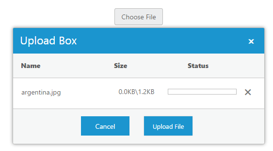
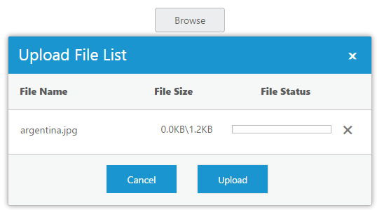
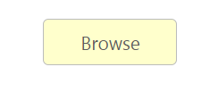

# Appearance and styling 

The **Uploadbox** widget provides support to customize the **dialog box** text and **button** text. 

## Customizing Button Text

The following table contains the **sub properties** available under **buttonText** property. To customize the text, pass the alternate text with corresponding **sub properties**. 

Sub-properties under buttonText property

<table>
<tr>
<th>
Name</th><th>
Description</th><th>
Data Type</th></tr>
<tr>
<td>
browse</td><td>
Sets the alternative text for browse button. </td><td>
String</td></tr>
<tr>
<td>
upload</td><td>
Sets the alternative text for upload button. </td><td>
String</td></tr>
<tr>
<td>
cancel</td><td>
Sets the alternative text for cancel button. </td><td>
String</td></tr>
</table>

The following steps explain the configuration of **buttonText** property in **Uploadbox**. 

In the **HTML** page, add the **&lt;div&gt;** element to configure the **Uploadbox** element.



    




/// <reference path="../tsfiles/jquery.d.ts" />
/// <reference path="../tsfiles/ej.web.all.d.ts" />

module UploadboxComponent {
    // Initialize the control in JavaScript.
    $(function () {
        //Declaration.
        var sample = new ej.Uploadbox($("#Uploadbox"),{
            saveUrl: "saveFiles.ashx",
            removeUrl: "removeFiles.ashx",
            buttonText: { browse: "Choose File", upload: "Upload File", cancel: "Cancel Upload" }
        });
    });
}


For **JS**, configure **saveFiles.ashx** and **removeFiles.ashx** files as mentioned in the Save file action and Remove file action respectively.

The following screenshot displays the output.

 

## Customizing Upload Dialog

The following table contains the **sub properties** available under **Uploadbox’s DialogText** property. To customize the text, pass the alternate text with corresponding **sub properties**. 

Sub properties under dialogText property.

<table>
<tr>
<th>
Name</th><th>
Description</th></tr>
<tr>
<td>
title</td><td>
Sets the alternative text for Title of <b>Uploadbox</b> dialog. </td></tr>
<tr>
<td>
name</td><td>
Sets the alternative text for Name column.  </td></tr>
<tr>
<td>
size</td><td>
Sets the alternative text for Size column. </td></tr>
<tr>
<td>
status</td><td>
Sets the alternative text for status column.</td></tr>
</table>

The following steps explain the configuration of **dialogText** property in **Uploadbox**. 

In the **HTML** page, add the **&lt;div&gt;** element to configure the **Uploadbox** element.



    





/// <reference path="../tsfiles/jquery.d.ts" />
/// <reference path="../tsfiles/ej.web.all.d.ts" />

module UploadboxComponent {
    // Initialize the control in JavaScript.
    $(function () {
        //Declaration.
        var sample = new ej.Uploadbox($("#Uploadbox"),{
            saveUrl: "saveFiles.ashx",
            removeUrl: "removeFiles.ashx",
            dialogText: { title: "Upload File List", name: "File Name", size: "File Size", status: "File Status" }
        });
    });
}


For **JS**, configure **saveFiles.ashx** and **removeFiles.ashx** files as mentioned in the Save file action and Remove file action respectively. 

The following screenshot displays the output.

 

## Show or Hide File details 

You have an option to **show** or **hide** **file** **details** in the **uploaded file list** **dialog**. By using this property, the **uploaded file dialog** does not display the file details once selected. To enable this, set **showFileDetails** to ‘**false**’. By default, its value is set to ‘**true**’. The data type is **Boolean**.

The following steps explains the configuration of **showFileDetails** property in **Uploadbox**.

In the **HTML** page, add the **&lt;div&gt;** element to configure the **Uploadbox** element.



    





/// <reference path="../tsfiles/jquery.d.ts" />
/// <reference path="../tsfiles/ej.web.all.d.ts" />

module UploadboxComponent {
    // Initialize the control in JavaScript.
    $(function () {
        //Declaration.
        var sample = new ej.Uploadbox($("#Uploadbox"),{
            saveUrl: "saveFiles.ashx",
            removeUrl: "removeFiles.ashx",
            showFileDetails: false
        });
    });
}



 For **JS**, configure **saveFiles.ashx** and **removeFiles.ashx** files as mentioned in the Save file action and Remove file action respectively.

## Theme

**Uploadbox** control’s style and appearance are controlled based on **CSS** classes. In order to apply styles to the **Uploadbox** control, you can refer to two files namely, **ej.widgets.core.min.css** and **ej.theme.min.css**. When the file **ej.widgets.all.min.css** is referred, then it is not necessary to include the files **ej.widgets.core.min.css** and **ej.theme.min.css** in your project**,** as **ej.widgets.all.min.css** is the combination of these both files. 

By default, there are 12-theme support available for **Uploadbox** control namely,

* Default-theme
* Flat-azure-dark
* Fat-lime
* Flat-lime-dark
* Flat-saffron
* Flat-saffron-dark
* Gradient-azure
* Gradient-azure-dark
* Gradient-lime
* Gradient-lime-dark
* Gradient-saffron
* Gradient-saffron-dark

## Custom CSS

**CSS** **class** customizes the **Uploadbox** control’s appearance. Define a **CSS** **class** as per the requirement and assign the class name to **cssClass** property. The data type is **string**. 

The following steps explain the configuration of **cssClass** property in **Uploadbox**. 

In the **HTML** page, add the **&lt;div&gt;** element to configure the **Uploadbox** element.



    





/// <reference path="../tsfiles/jquery.d.ts" />
/// <reference path="../tsfiles/ej.web.all.d.ts" />

module UploadboxComponent {
    // Initialize the control in JavaScript.
    $(function () {
        //Declaration.
        var sample = new ej.Uploadbox($("#Uploadbox"),{
            saveUrl: "saveFiles.ashx",
            removeUrl: "removeFiles.ashx",
            cssClass: "custom"
        });
    });
}


 In **CSS**, configure Custom Styles for the **Uploadbox**.





 For **JS**, configure **saveFiles.ashx** and **removeFiles.ashx** files as mentioned in the Save file action and Remove file action respectively.

The following screenshot displays the output.

